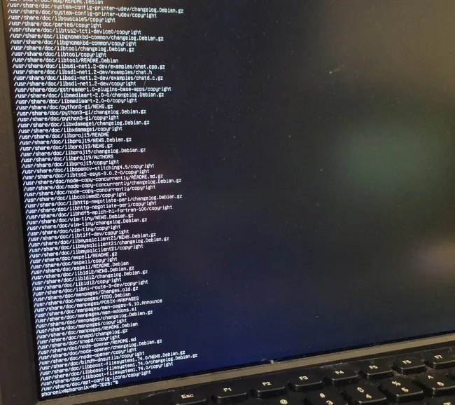
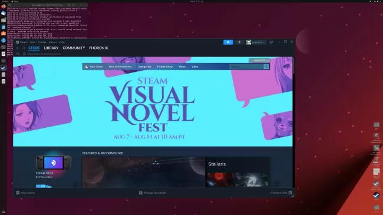
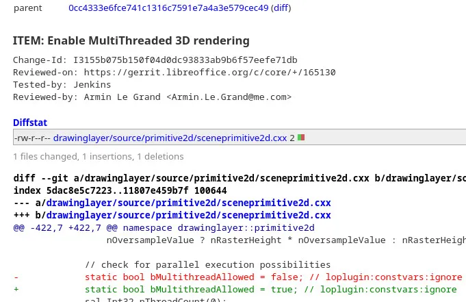

# 今日开源新闻汇总2024-3-23
## 新闻1
在今天为Linux 6.9内核发布的帧缓冲设备"FBDEV"子系统更改中，支持了更大的控制台字体，以更好地处理当今的~4K显示器。
 
与32像素的字体宽度/高度不同，Linux 6.9的更新现在允许最大的VT控制台字体宽度为64，最大高度为128像素。
 
Samuel Thibault自由地将最大的VT控制台字体大小增加到64 x 128。作为更改的一部分，他切换到位图，而不仅仅是使用现有的FBDEV代码的更大的整数大小。他在调整代码以允许64 x 128的增大尺寸的补丁中解释道：
 
*“通过使用位图，我们实际上支持我们想要的任何大小，但是控制台目前将字体限制为64x128（这在4k屏幕上提供了60x16的文本），所以我们现在不需要更多，以后可以轻松增加。”*
 
允许更大的尺寸应该受到那些在当今的高分辨率显示器上使用帧缓冲控制台的人们的欢迎。这个更改以及各种FBDEV修复是Linux 6.9的这个拉取请求的一部分。
 

## 新闻2
AMD于周四发布了AOMP 19.0-0，这是他们的LLVM/Clang下游编译器的最新版本，专注于为他们的Radeon GPU和Instinct加速器提供最新的OpenMP设备卸载支持。
 
AOMP 19.0-0的版本升级是由于现在跟踪最新的LLVM/Clang 19.0上游Git，鉴于最近LLVM/Clang 18的稳定发布。有了这个AOMP 19.0-0的发布，他们现在正在构建针对ROCm 6.0.2的源代码，现在默认不使用多个SDMA引擎，性能改进，对GFX1103 GPU的ROCgdb支持，以及各种其他修复。
 
可以从GitHub获取AOMP 19.0-0的源代码以及适用于Ubuntu、SUSE和RHEL/CentOS系统的二进制文件。
 

## 新闻3
Facebook/Meta在2022年将BOLT上游化到LLVM中，允许在链接后的步骤中优化二进制文件的布局，以提高性能。像Profile Guided Optimizations (PGO)一样，BOLT首先需要进行分析步骤，生成perf记录以反馈优化过程，但收益可以很大。
 
BOLT可以产生非常好的性能提升，因为它重新组织了库/二进制文件的布局，这在各种工作负载中都有所显示。GNOME开发者Christian Hergert最近对LLVM的BOLT表示赞赏。
 
在使用BOLT进行实验时，他在使用GNOME文本编辑器时生成了一个perf记录，然后使用它来优化Pango库的布局。随着库的优化，他看到测量文本所花费的时间减少了大约6%，这是被分析过程中最昂贵的部分之一。这是在其他所有事情之上的一个不错的胜利。LLVM BOLT是一个非常吸引人的努力，希望它能继续得到更多的采用以及代码本身的改进。
 
那些对Hergert初次使用LLVM BOLT感兴趣的人可以在他的博客上找到详细信息。
 

## 新闻4
由于一些游戏会检查显卡的供应商ID并匹配到NVIDIA，然后就假设正在使用的是NVIDIA的官方（专有）驱动程序，Mesa NVK Vulkan驱动程序已经添加了一个解决方法，允许隐藏供应商ID，以便绕过针对驱动程序版本使用的NVIDIA特定检查。
 
类似于Intel Vulkan驱动程序为一些游戏隐藏其供应商ID，以避免在XeSS存在时产生错误的假设导致的问题，Mesa NVK Vulkan驱动程序现在也能够隐藏其真实的供应商ID，以绕过进行NVIDIA特定检查的游戏。有些游戏只是匹配供应商ID，然后从那里期望NVIDIA的专有驱动程序，并比较与Mesa NVK驱动程序无关的版本号，现在在Mesa 24.1中有了供应商ID隐藏功能。
 
这解决了一些在不通过NVIDIA驱动程序版本比较检查时无法在NVK上运行的游戏的问题，比如认为用户的显卡驱动程序已经过时，实际上只是因为使用了NVK驱动程序。NVK现在支持DriConf供应商ID选项，并最初用于游戏《巴尔杜尔之门3》和《X4基金会》，以便让这些游戏在这款开源的NVIDIA Vulkan驱动程序上运行起来。当发现其他标题对NVK和NVIDIA驱动程序做出错误的假设时，可以很容易地使用DriConf解决方法添加其他游戏。
 
对于感兴趣的人，可以在合并请求中找到详细信息。
 

## 新闻5
最新的LibreOffice绘图代码已经启用了对多线程3D渲染的支持。
 
LibreOffice的绘图层现在已经设置为启用多线程渲染。线程数基于可用的CPU线程数，对于正在绘制的任何内容，每个线程/处理器至少有10像素的高度用于分配工作。
 
在周四提交到LibreOffice Git的这个提交中，现在已经启用了多线程渲染代码。对于这个开源办公套件的下一个版本，LibreOffice 24.8（预计在8月份发布），将会有更多的多线程工作和性能优化，这将是非常有趣的。
 

## 新闻6
