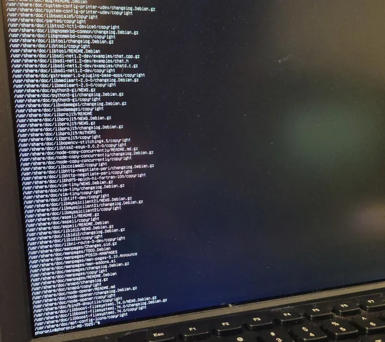
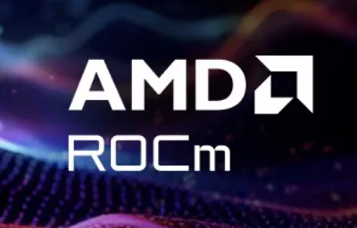
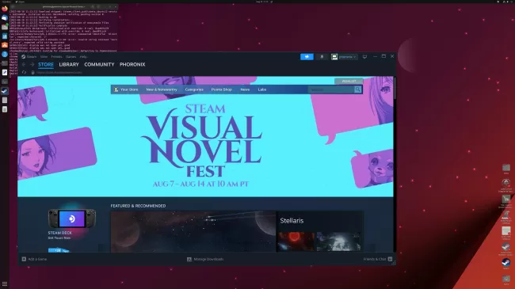
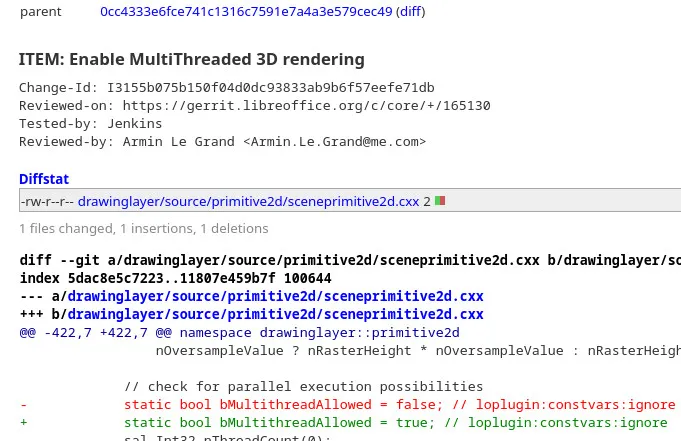
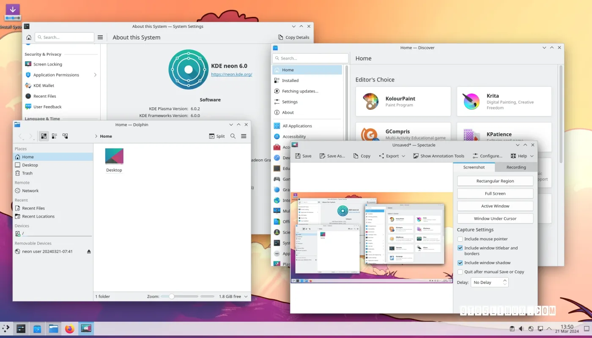
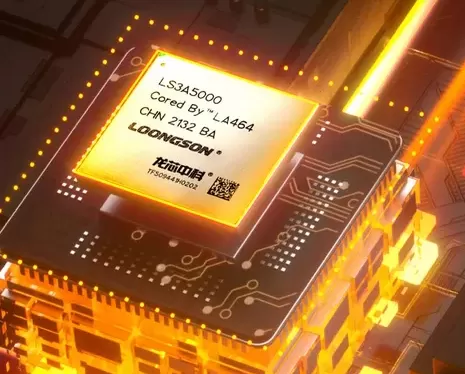
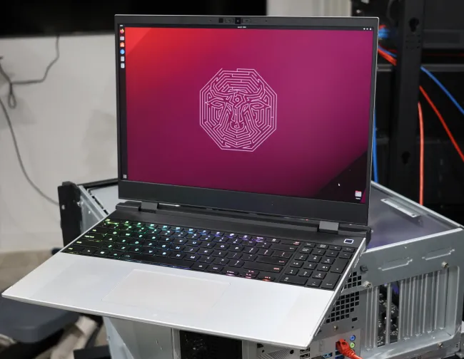

# 今日开源新闻汇总2024-3-23
## 新闻1
在今天为Linux 6.9内核发布的帧缓冲设备"FBDEV"子系统更改中，支持了更大的控制台字体，以更好地处理当今的~4K显示器。
 
与32像素的字体宽度/高度不同，Linux 6.9的更新现在允许最大的VT控制台字体宽度为64，最大高度为128像素。
 
Samuel Thibault自由地将最大的VT控制台字体大小增加到64 x 128。作为更改的一部分，他切换到位图，而不仅仅是使用现有的FBDEV代码的更大的整数大小。他在调整代码以允许64 x 128的增大尺寸的补丁中解释道：
 
*“通过使用位图，我们实际上支持我们想要的任何大小，但是控制台目前将字体限制为64x128（这在4k屏幕上提供了60x16的文本），所以我们现在不需要更多，以后可以轻松增加。”*
 
允许更大的尺寸应该受到那些在当今的高分辨率显示器上使用帧缓冲控制台的人们的欢迎。这个更改以及各种FBDEV修复是Linux 6.9的这个拉取请求的一部分。
 

## 新闻2
AMD于周四发布了AOMP 19.0-0，这是他们的LLVM/Clang下游编译器的最新版本，专注于为他们的Radeon GPU和Instinct加速器提供最新的OpenMP设备卸载支持。
 
AOMP 19.0-0的版本升级是由于现在跟踪最新的LLVM/Clang 19.0上游Git，鉴于最近LLVM/Clang 18的稳定发布。有了这个AOMP 19.0-0的发布，他们现在正在构建针对ROCm 6.0.2的源代码，现在默认不使用多个SDMA引擎，性能改进，对GFX1103 GPU的ROCgdb支持，以及各种其他修复。
 
可以从GitHub获取AOMP 19.0-0的源代码以及适用于Ubuntu、SUSE和RHEL/CentOS系统的二进制文件。
 

## 新闻3
Facebook/Meta在2022年将BOLT上游化到LLVM中，允许在链接后的步骤中优化二进制文件的布局，以提高性能。像Profile Guided Optimizations (PGO)一样，BOLT首先需要进行分析步骤，生成perf记录以反馈优化过程，但收益可以很大。
 
BOLT可以产生非常好的性能提升，因为它重新组织了库/二进制文件的布局，这在各种工作负载中都有所显示。GNOME开发者Christian Hergert最近对LLVM的BOLT表示赞赏。
 
在使用BOLT进行实验时，他在使用GNOME文本编辑器时生成了一个perf记录，然后使用它来优化Pango库的布局。随着库的优化，他看到测量文本所花费的时间减少了大约6%，这是被分析过程中最昂贵的部分之一。这是在其他所有事情之上的一个不错的胜利。LLVM BOLT是一个非常吸引人的努力，希望它能继续得到更多的采用以及代码本身的改进。
 
那些对Hergert初次使用LLVM BOLT感兴趣的人可以在他的博客上找到详细信息。
 

## 新闻4
由于一些游戏会检查显卡的供应商ID并匹配到NVIDIA，然后就假设正在使用的是NVIDIA的官方（专有）驱动程序，Mesa NVK Vulkan驱动程序已经添加了一个解决方法，允许隐藏供应商ID，以便绕过针对驱动程序版本使用的NVIDIA特定检查。
 
类似于Intel Vulkan驱动程序为一些游戏隐藏其供应商ID，以避免在XeSS存在时产生错误的假设导致的问题，Mesa NVK Vulkan驱动程序现在也能够隐藏其真实的供应商ID，以绕过进行NVIDIA特定检查的游戏。有些游戏只是匹配供应商ID，然后从那里期望NVIDIA的专有驱动程序，并比较与Mesa NVK驱动程序无关的版本号，现在在Mesa 24.1中有了供应商ID隐藏功能。
 
这解决了一些在不通过NVIDIA驱动程序版本比较检查时无法在NVK上运行的游戏的问题，比如认为用户的显卡驱动程序已经过时，实际上只是因为使用了NVK驱动程序。NVK现在支持DriConf供应商ID选项，并最初用于游戏《巴尔杜尔之门3》和《X4基金会》，以便让这些游戏在这款开源的NVIDIA Vulkan驱动程序上运行起来。当发现其他标题对NVK和NVIDIA驱动程序做出错误的假设时，可以很容易地使用DriConf解决方法添加其他游戏。
 
对于感兴趣的人，可以在合并请求中找到详细信息。
 

## 新闻5
最新的LibreOffice绘图代码已经启用了对多线程3D渲染的支持。
 
LibreOffice的绘图层现在已经设置为启用多线程渲染。线程数基于可用的CPU线程数，对于正在绘制的任何内容，每个线程/处理器至少有10像素的高度用于分配工作。
 
在周四提交到LibreOffice Git的这个提交中，现在已经启用了多线程渲染代码。对于这个开源办公套件的下一个版本，LibreOffice 24.8（预计在8月份发布），将会有更多的多线程工作和性能优化，这将是非常有趣的。
 

## 新闻6
KDE项目今天发布了KDE Gear 24.02.1，这是最新的KDE Gear 24.02软件套件的第一个维护更新，为许多默认的KDE应用程序带来了错误修复和改进。
 
KDE Gear 24.02.1改进了Dolphin的图标，使其再次随着强调色变化，改进了Spectacle屏幕截图工具，允许用户在屏幕录制后立即进行屏幕截图，并解决了Okular文档查看器中多行文本选择的问题。
 
Kdenlive视频编辑器收到了许多错误修复，这些错误与字体损坏、使用鼠标中键进行时间线平移、某些序列属性的错误保存、启动崩溃、尝试在打开损坏的文件后恢复备份时的崩溃、多个字幕问题，以及在组中移动单个项目时的崩溃有关。
 
此版本还改进了Gwenview图像查看器，使其在打开某些FITS图像文件时不再崩溃，并改进了Dolphin文件管理器，使其在最小化Dolphin窗口时不再隐藏所有面板，并保存“以文件夹形式打开档案”的设置。
 
KDE Gear 24.02.1还改进了Yakuake下拉终端模拟器，使其在使用某些皮肤时不再崩溃，改进了Elisa音乐播放器的移动播放列表和键盘可访问性，并更新了KAlarm应用程序，使其能够播放远程音频文件。
 
Kate文本编辑器也进行了一些更改，因此在打开上下文菜单后，其工具提示现在被隐藏，更好地处理URL，提高安全性，使其不会在非数组上崩溃，修复移除括号时彩虹高亮断裂的问题，并改进了在打开大量文档时的标签切换器的性能。
 
此外，KClock的计时器被移植为通过自定义闹钟播放器而不是通知播放响铃声，KDEPIM接收到etesync和NTLMv2支持，Kleopatra的配置文件的加载和保存被修复，Knights棋类游戏在游戏结束时不再崩溃。
 
Konsole终端模拟器现在支持HTMLDecoder中的非BMP代码点，KSudoku在游戏视图中接收到改进的HiDPI渲染，Tokodon的Mastodon客户端现在默认具有视频播放器控制的边距，侧边栏的改进键盘导航和通知分组。
 
像NeoChat、Merkuro、KWalletManager、KTorrent、KOrganizer、Konversation、Konqueror、KMail、KHangMan、KCalc、KAtomic、KBackup、Kalk、Itinerary、AudioTube、Ark、Angelfish、Alligator、Akregator、Cantor和KAddressBook等应用程序也接收到了小的更改，所以查看完整的更改日志以获取更多详细信息。
 
KDE Gear 24.02.1将进入各种流行的GNU/Linux发行版的稳定软件仓库，所以请确保你随时保持你的安装更新，以享受更好的KDE Plasma 6桌面和应用程序体验。
 

## 新闻7
Loongson继续为他们的LoongArch处理器端口启用更多的内核功能，以供上游Linux内核使用。他们今天发布了一组补丁，为这种CPU架构启用了更多的功能。
 
对于Linux 6.9，LoongArch架构代码现在允许支持objtool，以在内核构建过程中对对象文件进行不同的验证和转换。新的LoongArch代码还启用了ORC堆栈展开器支持，内核实时修补支持，用于在不重启的情况下对运行中的内核应用安全/错误修复，并启用了更多的内核配置功能。
 
总的来说，这是LoongArch在这一轮中的一个很好的增量更新，继续为这种源自MIPS64并部分受到RISC-V启发的CPU架构解决更多的内核特性。然而，当前一代的LoongArch处理器的速度仍然比AMD、Intel和Arm的设计慢得多。
 
*1, 为LoongArch添加objtool支持；*
 
*2, 为LoongArch添加ORC堆栈展开器支持；*
 
*3, 为LoongArch添加内核实时修补支持；*
 
*4, 在Kconfig中选择ARCH_HAS_CURRENT_STACK_POINTER；*
 
*5, 在Kconfig中选择HAVE_ARCH_USERFAULTFD_MINOR；*
 
*6, 一些错误修复和其他小的更改。*
 
Linux 6.9的LoongArch更新的完整列表可以通过拉取请求找到。Linux 6.9的合并窗口将在本周末结束，随后将发布Linux 6.9-rc1版本。
 

## 新闻8
AOMP是基于LLVM/Clang编译器的OpenMP设备卸载工具，而在GNU编译器集合（GCC）中的AMDGCN后端也支持Radeon GPU的OpenMP设备卸载能力，但并不像AOMP那样广为人知或功能丰富。即将发布的GCC 14.1稳定版中加入了对AMD APU的GFX1103支持，这是RDNA3集成图形的一部分。
 
Bay Libre的Andrew Stubbs一直在为GCC卸载工作提供RDNA2和RDNA3的支持，他今天将GFX1103的支持合并到GCC Git中，用于处理AMD RDNA3 “Phoenix” SoC中的图形IP。
 
Stubbs在提交GFX1103支持时写道： 
 
*“添加对gfx1103 RDNA3 APU集成图形设备的支持。ROCm文档警告这些可能不被支持，但它似乎至少有一部分是工作的。”*
 
GCC的AMDGCN支持并不像LLVM的AMDGPU后端那样成熟，也不像AMD官方支持的AOMP编译器那样完善，但至少Bay Libre的开发者和其他人继续努力增强这一GCC设备支持。
 

