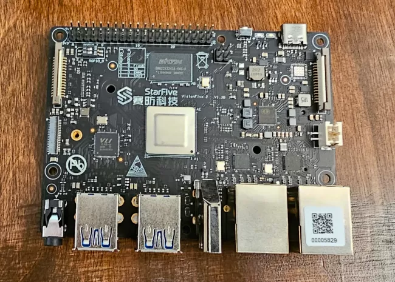
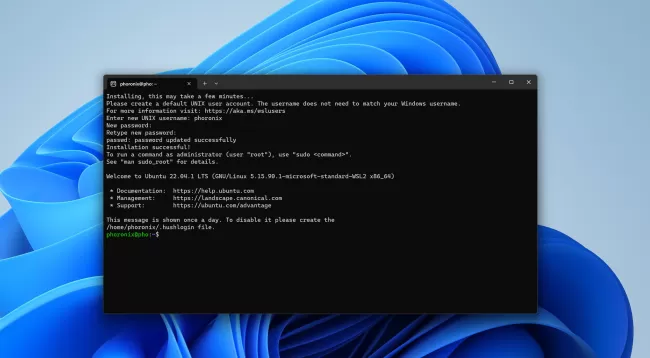

# 今日开源新闻汇总2024-3-24
## 新闻1
Linux 6.9内核的RISC-V架构更新今天发布，预计在本周日发布v6.9-rc1版本之前。
 
Linux 6.9中的RISC-V新增了对更多向量加速的加密例程的支持。其中包括RISC-V向量加速的AES-{ECB,CBC,CTR,XTS}、ChaCha20、GHASH、SHA-256、SHA-384、SHA-512、SM3和SM4算法。
 
新的RISC-V内核现在还支持便携式内核构建的系统休眠支持、快速GUP处理、基于membarrier的指令缓存同步支持、ACPI LPI和CPPC支持等其他新增功能。 
 
Linux 6.9合并窗口期间的RISC-V补丁：
 
*支持各种向量加速的加密例程。*
 
*现在为便携式内核构建启用了休眠功能。*
 
*在具有更大VA的系统上，mmap_rnd_bits_max更大。*
 
*支持快速GUP。*
 
*支持基于membarrier的指令缓存同步。*
 
*支持Andes hart级别的中断控制器和PMU。*
 
*围绕未对齐访问速度探测和Kconfig设置进行了一些清理。*
 
*支持ACPI LPI和CPPC。*
 
*与屏障相关的各种清理。*
 
*一些修复。*
 
Linux 6.9的完整RISC-V补丁列表可以通过拉取请求找到。
 

## 新闻2
微软正在为Windows子系统Linux（WSL）用户推出WSL 2.2.1版本，该版本提供了更可靠的网络支持、挂起修复和其他改进。
 
去年，作为一项实验性功能，微软向Windows子系统Linux添加了DNS隧道支持，以提高网络兼容性。这种DNS隧道是为了解决某些WSL用户因虚拟机向Windows主机发送的DNS网络数据包被防火墙设置、VPN或其他网络情况阻止而无法访问互联网的问题。启用DNS隧道后，将使用虚拟化功能直接与Windows通信，从而避免向主机发送网络数据包。
 
经过几个月的证明，DNS隧道非常有价值且稳定，微软现在默认启用它，以在WSL上提供更强大、更可靠的网络体验。在WSL 2.2.1中，微软还将DNS隧道与Linux原生的Docker支持集成在一起。
 
WSL 2.2.1还更改了默认的回收模式为drop cache，修复了某些情况下的挂起问题，更新了较新的Linux 5.15 LTS内核版本，并在GitHub上进行了其他更新。
 

## 新闻3
Wine 9.5作为这款开源软件的最新双周开发版本发布，让Linux用户可以享受Windows游戏和应用程序。
 
Wine 9.5版本的亮点包括：
 
-在widl中支持初始SLTG格式的类型库。
 
-ARM64EC上的异常处理。
 
-对Minidump支持的改进。
 
-各种错误修复。
 
在过去两周中，已知的27项错误修复范围从D2D1代码的构建问题到《火箭联盟》游戏崩溃，再到《上古卷轴在线》和《古墓丽影3》游戏问题，以及其他多个游戏的修复。
 
Wine 9.5的完整变更列表和不同的错误修复可以通过WineHQ.org找到。
 

## 新闻4
