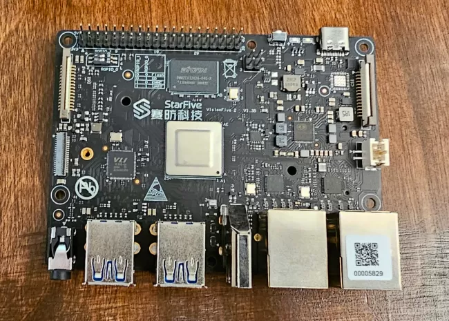
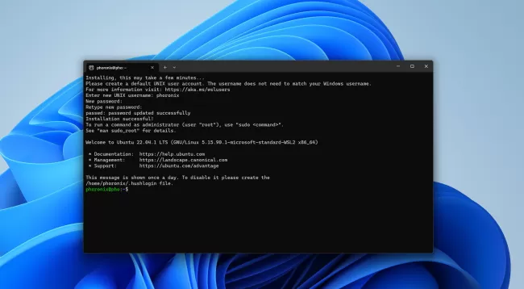
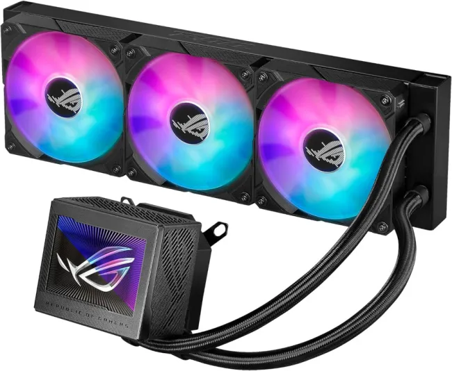
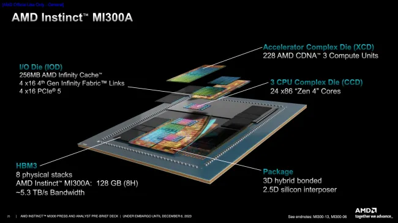
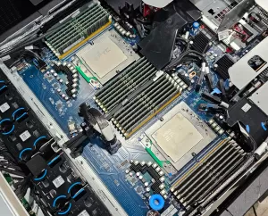

# 今日开源新闻汇总2024-3-24
## 新闻1
Linux 6.9内核的RISC-V架构更新今天发布，预计在本周日发布v6.9-rc1版本之前。
 
Linux 6.9中的RISC-V新增了对更多向量加速的加密例程的支持。其中包括RISC-V向量加速的AES-{ECB,CBC,CTR,XTS}、ChaCha20、GHASH、SHA-256、SHA-384、SHA-512、SM3和SM4算法。
 
新的RISC-V内核现在还支持便携式内核构建的系统休眠支持、快速GUP处理、基于membarrier的指令缓存同步支持、ACPI LPI和CPPC支持等其他新增功能。 
 
Linux 6.9合并窗口期间的RISC-V补丁：
 
*支持各种向量加速的加密例程。*
 
*现在为便携式内核构建启用了休眠功能。*
 
*在具有更大VA的系统上，mmap_rnd_bits_max更大。*
 
*支持快速GUP。*
 
*支持基于membarrier的指令缓存同步。*
 
*支持Andes hart级别的中断控制器和PMU。*
 
*围绕未对齐访问速度探测和Kconfig设置进行了一些清理。*
 
*支持ACPI LPI和CPPC。*
 
*与屏障相关的各种清理。*
 
*一些修复。*
 
Linux 6.9的完整RISC-V补丁列表可以通过拉取请求找到。
 

## 新闻2
微软正在为Windows子系统Linux（WSL）用户推出WSL 2.2.1版本，该版本提供了更可靠的网络支持、挂起修复和其他改进。
 
去年，作为一项实验性功能，微软向Windows子系统Linux添加了DNS隧道支持，以提高网络兼容性。这种DNS隧道是为了解决某些WSL用户因虚拟机向Windows主机发送的DNS网络数据包被防火墙设置、VPN或其他网络情况阻止而无法访问互联网的问题。启用DNS隧道后，将使用虚拟化功能直接与Windows通信，从而避免向主机发送网络数据包。
 
经过几个月的证明，DNS隧道非常有价值且稳定，微软现在默认启用它，以在WSL上提供更强大、更可靠的网络体验。在WSL 2.2.1中，微软还将DNS隧道与Linux原生的Docker支持集成在一起。
 
WSL 2.2.1还更改了默认的回收模式为drop cache，修复了某些情况下的挂起问题，更新了较新的Linux 5.15 LTS内核版本，并在GitHub上进行了其他更新。
 

## 新闻3
Wine 9.5作为这款开源软件的最新双周开发版本发布，让Linux用户可以享受Windows游戏和应用程序。
 
Wine 9.5版本的亮点包括：
 
-在widl中支持初始SLTG格式的类型库。
 
-ARM64EC上的异常处理。
 
-对Minidump支持的改进。
 
-各种错误修复。
 
在过去两周中，已知的27项错误修复范围从D2D1代码的构建问题到《火箭联盟》游戏崩溃，再到《上古卷轴在线》和《古墓丽影3》游戏问题，以及其他多个游戏的修复。
 
Wine 9.5的完整变更列表和不同的错误修复可以通过WineHQ.org找到。
 

## 新闻4
KDE开发者们一直忙于修复新的KDE Plasma 6桌面堆栈的各种回归问题——包括一些崩溃。Plasma 6.0.3将在下周发布，带来更多修复，同时也在进行Plasma 6.1的一些新功能开发工作。
 
KDE开发者Nate Graham发布了他的常规每周开发总结，突出显示了KDE本周的所有进展。本周的亮点包括：
 
-为即将在下周发布的KDE Plasma 6.0.3做准备，包括一些X11回归修复。
 
-KDE的Ark压缩文件管理器现在可以打开和提取自解压的.exe文件。
 
-各种系统设置UI改进。
 
-在Wayland上安装字体现在可以正确工作，而不会导致系统设置崩溃。
 
-修复了在应用新的窗口装饰主题时另一个系统设置崩溃的问题。
 
-在Spotify内播放某些音乐视频时，Plasma不再崩溃。
 
-允许XWayland窗口即使没有键盘焦点也能获取剪贴板内容，因为受限行为正在破坏一些基于XWayland/X11的应用程序。
 
-各种其他错误和回归修复。
 
更多关于本周KDE代码变更的详细信息，请访问Nate的博客。
 

## 新闻5
在Linux的Direct Rendering Manager (DRM) / Kernel Mode-Setting (KMS) 显示驱动方面，目前正在进行一些使用Rust语言的开发工作。这包括Asahi Linux项目针对Apple Silicon内核图形驱动的努力，以及Red Hat的新项目Nova，这是一个针对NVIDIA图形硬件的现代开源内核驱动。Red Hat最近发布了KMS的Rust绑定供审查，并且还将现有的Virtual KMS驱动（VKMS）移植到Rust，称为"RVKMS"驱动。
 
Lyude Paul在周五发布了用于审查的补丁，这些补丁将VKMS驱动程序移植到Rust，并为KMS提供了必要的Rust绑定。这些Rust绑定对于Nova和未来的其他DRM/KMS驱动程序非常重要。
 
作为提醒，VKMS是一个简单的虚拟KMS驱动程序，通常用于测试目的和其他基本用途。VKMS提供了一个虚拟显示，用于无头系统或其他测试。由于它是一个相对简单的驱动程序，因此它成为了移植和测试内核接口的理想候选者。
 
有兴趣的人可以查看这一系列补丁，了解提议的Rust绑定和初始的RVKMS驱动代码。不过，需要注意的是，RVKMS驱动目前仍然是一个进行中的项目，驱动补丁目前带有这样的通知：
 
*"这引入了一个VKMS驱动程序到Rust的进行中的移植，以提供给内核的新Rust绑定的KMS驱动程序用户！这个驱动程序非常不完整，我甚至不确定它现在是否能在不崩溃的情况下加载（但它曾经在某个时刻可以，我很快就会检查！）。"*
 
总之，越来越多的开源Linux驱动开发者对于在适当的情况下将代码转移到Rust感兴趣，这主要是为了更好的内存安全和安全性，降低新开发者的入门门槛，以及其他好处。
 

## 新闻6
Linux 6.9 版本在硬件监控 “HWMON” 子系统中合并了一些更新，这些更新包括了越来越多的一体式液体/水冷却系统获得 Linux 驱动支持，以便于进行便捷的监控和控制。
 
Linux 6.9 版本的 HWMON 更新引入了一个新的 “asus_rog_ryujin” 驱动程序，用于支持 ASUS ROG RYUJIN II 360 AIO 冷却器。这款 AIO 冷却器配备了三个 120 毫米的风扇，并且与当前的 AMD 和 Intel 处理器兼容。Linux HWMON 驱动程序允许监控水泵速度、风扇速度，并在有能力的情况下进行控制。
 
Linux 6.9 还增加了 “nzxt-kraken3” 驱动程序，作为最新的 NZXT Kraken AIO 冷却器驱动程序版本，支持最新的 Kraken X 和 Kraken Z AIO 冷却器。这个驱动程序已经在 NZXT KrakenX53/X63/X73 和 Z53/Z63/Z73 液体冷却器上进行了测试，可以显示液体温度、水泵速度、PWM 控制以及连接风扇的速度/工作率。
 
Linux 6.9 HWMON 还为 Microsoft Surface 设备、MPS MPQ878、Astera Labs PT5161L 重新定时器、ASPEED G6 PWM/风扇转速计和 Amphenol ChipCap 2 带来了新的硬件监控驱动程序。此次更新还为 nct6683 驱动程序添加了 MSI ID，为 OXP-Sensors 驱动程序中的 Ayaneo Air Plus 7320u 提供了支持，并且为 dell-smm 驱动程序中的 Dell XPS 9315 提供了支持。
 
更多关于 Linux 6.9 中这些硬件监控驱动程序更新的详细信息，请查看此次合并请求。
 

## 新闻7
DIRT 5赛车游戏是之前在Linux下的Intel图形硬件上无法运行的游戏之一，原因是ANV Vulkan驱动对稀疏内存的支持不足。但现在，启用了稀疏支持后，游戏在启动时会崩溃。不过，现在有了一个解决办法，可以让Intel的Mesa 24.1 Vulkan驱动与DIRT 5一起工作。
 
这个已有5个月历史的bug报告一直在跟踪DIRT 5在启用稀疏内存支持的情况下，使用Intel Vulkan Linux驱动时的崩溃问题。通过VKD3D日志，发现这是由于FP64错误所致。
 
但Intel ANV驱动确实有一个"fp64_workaround_enabled"选项，当着色器使用float64且设备不支持该类型时，可以使用软FP64。现在，只需为Intel ANV驱动启用这个FP64解决方案，并与ANV稀疏支持配合使用，就足以让使用Intel Arc Graphics的Linux玩家享受DIRT 5游戏了。
 
今天在Mesa 24.1中合并的更新应用了这个FP64解决方案，当检测到DIRT 5进程名时就会启用。现在，这款Windows游戏在Linux上通过Steam Play运行，已经处于可玩状态。
 

## 新闻8
Linux 6.9版本对错误检测和纠正（EDAC）子系统的更新主要集中在AMD的改变上。
 
正如几周前所讨论的，AMD正在将FRU内存毒物管理器上游传输，这个新的内核代码确实已经成功地登陆了Linux 6.9。FRU内存毒物管理器允许在重启后持久化有关坏的/有故障的内存的信息。FRU内存毒物管理器最初是为AMD硬件设计的，并允许使用ACPI错误记录序列化表（ERST）来持久化重启后的内存错误信息。
 
这个FRU内存毒物管理器伴随着另一个新的Linux 6.9 EDAC特性：MI300系列的行退休支持，它允许在HBM3上退休过多不可纠正的ECC错误的内存行。行退休支持允许避免问题内存区域，而FRU内存毒物管理器允许（可选地）在重启后持久化，以避免重复相同的错误内存位。
 
Linux 6.9的EDAC代码还增加了AMD地址转换库代码，帮助将报告的硬件错误地址转换为AMD加速器世界的系统物理地址。
 
在Intel方面，EDAC的变化包括在iGEN6驱动程序中支持Alder Lake N SoC和在i10nm驱动程序中支持Intel Grand Ridge。上周的EDAC拉取包含了为Linux 6.9制作的全部错误检测和纠正补丁的完整列表。
 

## 新闻9
Linux 6.9版本对工作队列（WQ）代码进行了“重大且深入”的更改。Tejun Heo在Linux 6.9合并窗口开始时提交了所有工作队列的更改，他描述这一周期的更改包括一些重大且深入的变化：
 
*- 在6.6版本周期中，非绑定工作队列被更新，使其更加拓扑感知和灵活，这在其他方面改善了现代多L3 CPU上的工作队列行为。在此过程中，636b927eba5b（“workqueue: Make unbound workqueues to use per-cpu pool_workqueues”）将非绑定工作队列切换为使用每CPU前端pool_workqueues，作为增加前后映射灵活性的一部分。*
 
*这一变化的不受欢迎的副作用是，它使得每CPU的最大并发执行强制变得过高，从而增加了允许的最大并发执行数量。我错误地认为这不会引起实际问题，因为大多数非绑定工作队列用户都会自我调节最大并发数；然而，确实有一些不会这样做的（例如在IO路径上），允许的最大并发数的急剧增加导致了一些用例中明显的性能回退。*
 
*这一问题现在通过将最大并发执行强制分离到一个单独的结构——wq_node_nr_active——来解决，这使得@max_active一致地表示系统范围内的最大并发数，无论CPU数量或（最终）NUMA节点如何。这是一个相当深入的改变，在某些地方有点笨拙；然而，这种笨拙性源于在一些现代机器上处理执行局部性域和最大并发执行强制域之间的不一致的内在要求。更多细节请参见5797b1c18919（“workqueue: Implement system-wide nr_active enforcement for unbound workqueues”）。*
 
*- 添加了BH工作队列支持。它们类似于每CPU工作队列，但在softirq上下文中执行工作项。这预计将取代tasklet。然而，目前它缺少禁用和启用工作项的能力，这是转换许多tasklet用户所需要的。为了避免过多地拥挤这个合并窗口，这将被包括在下一个合并窗口中。将会为目前正在等待的几个转换补丁发送一个单独的拉取请求。*
 
*- Waiman解决了工作队列CPU隔离中的一个长期存在的问题，即有序工作队列没有遵循wq_unbound_cpumask更新。有序工作队列现在遵循与其他非绑定工作队列相同的规则。*
 
*- 更多CPU隔离改进：Juri修复了工作队列隔离中的另一个不足，即非绑定救援者不遵守wq_unbound_cpumask。Leonardo修复了在隔离CPU上触发的delayed_work定时器。*
 
*- 其他杂项更改。*
 
希望任何负面影响都将是最小的，在代码合并后的两周内，Linux 6.9 Git到目前为止似乎运行良好。Linux 6.9合并窗口将于明天关闭，并发布Linux 6.9-rc1版本。
 

