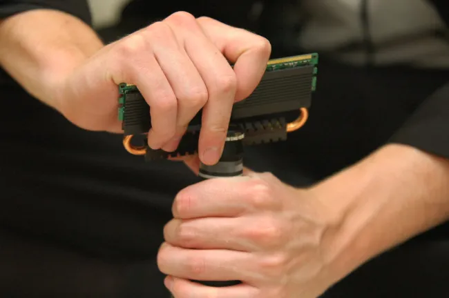
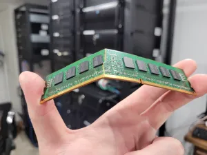
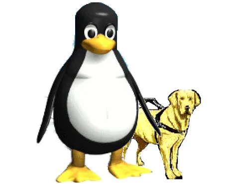
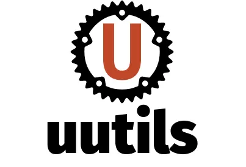
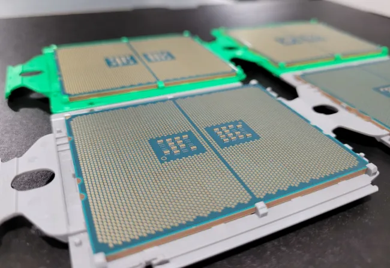
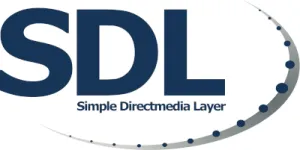

# 今日开源新闻汇总2024-3-25
## 新闻1
Linux 6.9 版本的 IO_uring 更新在几乎结束的合并窗口期间早期合并。这一轮又为这个精彩且创新的内核特性带来了一些新功能。
 
Linux 6.9 的 IO_uring 更新包括对每环 NAPI 的支持、对截断的支持、公开 SQPOLL 利用状态、使 task_work 内部循环更公平、multi-shot修复以及其他各种修复/清理。
 
由 Stefan Roesch 长期研究的 NAPI 忙轮询支持已经实现。利用 NAPI 忙轮询时，Stefan 测试的往返时间从 55 微秒降低到 38 微秒。补丁信息中有更多细节，供对这项新 IO_uring 功能感兴趣的人参考。
 
IO_uring 的截断（ftruncate）支持允许通过 IO_uring 进行原生截断，因此应用程序不再需要设置自己的线程池或卸载来进行非阻塞截断。
 
更多关于 Linux 6.9 的 IO_uring 更新的细节可以通过拉取请求查看，代码已经在今天的 Linux 6.9-rc1 版本发布前进入 Linux Git.
 

## 新闻2
在行业安全问题达到历史新高的情况下，Linux 6.9 版本正在进一步加强其安全防护，增加了各种额外的安全检查和其他编译时防御措施，以确保最佳的安全实践。
 
Kees Cook 在 Linux 6.9 合并窗口开始时提交了一系列硬化更新。他总结说这是“相当正常的”，并且在不同的变化和改进方面“到处都是”。
 
Linux 6.9 正在重新引入未定义行为消毒器（UBSAN）有符号溢出消毒器，以继续测试和改进编译器端，并发现其他方法使该消毒器对每个人更有用。之前由于与“-fno-strict-overflow”编译器选项配对时实际上无效，有符号溢出消毒器被移除。但随着消毒器的改进以及希望更好地检查意外的有符号环绕，消毒器的使用正在被恢复。
 
硬化拉取还包括各种 Kconfig 更新、头文件更新、删除一个 13 年老的 CAP_SYS_ADMIN 向后兼容性检查，以及其他一些小的变化，都是为了安全硬化。
 
这次合并后的拉取列出了进一步硬化 Linux 6.9 的变化。
 

## 新闻3
Linux 6.8 在 v6.5 版本中弃用了 SLAB 分配器，现在只留下 SLUB 来处理所有分配任务。对于 Linux 6.9，继续清理 SLAB 的移除，并对 SLUB 进行更多改进。
 
Vlastimil Babka 提交了 Linux 6.9 的 SLUB（SLAB）变更，并突出显示了以下几点：
 
*--自由列表加载优化（Chengming Zhou）*
 
*当每个 CPU 的 slab 耗尽并从 CPU 部分列表中加载新的 slab 时，优化加载过程以避免 IRQ 启用/禁用周期。这在 “perf bench sched messaging” 测试中带来了 3.5% 的性能提升。*
 
*--SLAB 移除后的内核启动参数清理（Xiongwei Song）*
 
*由于我们有两种不同的主要 slab 实现，我们的启动参数前缀要么是 slab_ 要么是 slub_，随着两种实现都获得相同的功能（即 slab_nomerge vs slub_nomerge），一些参数后来成为别名。为了最终摆脱特定于实现的名称，现在所有规范和文档化的参数都以 slab_ 为前缀，而 slub_ 变体成为已弃用但仍在工作的别名。*
 
*--SLAB_ kmem_cache 创建标志清理（Vlastimil Babka）*
 
*标志有硬编码的 #define 值，添加新值时变得繁琐且容易出错。通过枚举分配值，该枚举负责提供唯一的位号。还弃用了仅由 SLAB 使用的 SLAB_MEM_SPREAD，因为自 SLAB 移除后它就是一个空操作。将其分配一个明确的零值。标志使用的移除是在各个子系统中独立处理的，计划在下一个版本中最终移除任何剩余的使用。*
 
*--杂项清理和修复（Chengming Zhou、Xiaolei Wang、Zheng Yejian）*
 
*包括移除未使用的代码或函数参数，以及修复内存泄漏。*
 
这次拉取提供了构成 Linux 6.9 合并代码的完整补丁列表.
 

## 新闻4
Linux 内核中长期存在的 speakup 驱动程序是一个语音合成器，它可以作为各种合成器硬件的接口，并且用户空间软件可以通过 /dev/synth 与合成器接口提交数据。在 Linux 6.9 版本中，speakup 驱动程序有了两项有用的改进。
 
首先，speakup 驱动程序修复了提交到 /dev/synth 的 8 位字符的问题。添加了对无符号字符的支持，以避免在向设备写入 8 位字符时出现乱码的情况。
 
Linux 6.9 的另一个显著新增功能是为 speakup 驱动程序添加了 /dev/synthu 设备。由于大多数应用程序现在使用 UTF-8 编码，/dev/synthu 是一个在 /dev/synth 之上的新接口，允许合成非拉丁1字符。新的 /dev/synthu 设备限制为 16 位 Unicode，就像 speakup 的其他部分一样，任何奇怪的输入或超过 16 位的将被自动丢弃。
 
不熟悉这个语音合成 Linux 内核辅助功能的人可以通过 Linux-Speakup.org 了解更多信息和使用方法。
 
这些 speakup 改进是作为 Linux 6.9 合并窗口的 char/misc 变更的一部分发送的。char/misc 拉取的其余部分是通常的小型和相当随机的驱动程序更新/修复。
 

## 新闻5
uutils 的 Coreutils 0.0.25 新版本在本周末发布，这是用 Rust 编写的 GNU Coreutils 的替代品，用于 Linux 平台和其他系统上的常见工具。
 
在 v0.0.25 版本中，Rust Coreutils 自上一版本以来通过了额外的 15 个 GNU 测试套件用例。Rust Coreutils 继续朝着与 GNU Coreutils 完全兼容的目标努力，目标是通过所有测试。目前有 437 个测试通过，50 个被跳过，117 个失败。
 
v0.0.25 版本修复了各种标志，调整了各种错误消息以匹配 GNU 风格，改进了 Android CI，并进行了其他各种错误修复和兼容性增强。
 
更多关于 uutils Coreutils 0.0.25 版本的详细信息可以通过 GitHub 获得。
 
此外，推动 Rust Coreutils 进一步发展的是最近从德国的主权技术基金获得的资金支持。
 

## 新闻6
Linux 6.9 版本的基于内核的虚拟机（KVM）变更继续增强开源 Linux 虚拟化软件堆栈的功能。
 
对于 x86 (x86_64) 上的 KVM，有一个触发模拟事件的优化。开发人员发现这为 VM-Exit 微基准测试提供了大约 10% 的性能改进。
 
由于重新编写了围绕 x86_64 上的“强制立即退出”的代码，使得供应商代码决定如何以及何时强制退出，因此也有一些改进。这允许对 AMD 和 Intel 处理器进行优化。
 
还有其他一些较小的优化和代码改进。KVM x86 Xen 模拟代码在 Linux 6.9 中也有所改进。 
 
另一个值得注意的变化是，AMD 现在在 /proc/cpuinfo 中报告一个“ept_5level”标志，用于支持 5 级 EPT 分页的 VMX。这种用户空间查询 5 级分页支持的能力很重要，因为指示支持的 MSR 不容易被用户空间访问。需要这些信息，以便用户空间可以正确配置 AMD 5 级分页配置上的 KVM 虚拟机。
 
在 KVM RISC-V 方面，支持了 Ztso 和 Zacas 扩展。LoongArch 和 ARM 在这个周期中也看到了各种小的增强。
 
更多关于 Linux 6.9 的 KVM 变更的详细信息，请通过已经合并的拉取请求查看。Linux 6.9-rc1 应该在今天晚些时候发布，以结束 Linux 6.9 的合并窗口。
 

## 新闻7
Sam Lantinga 今天发布了 SDL3 的预览版本，以鼓励开发者测试新的 SDL 3.0 API。
 
SDL3 在这个常用于跨平台游戏的跨平台硬件/软件抽象层方面有了许多改进。新增了 Vulkan 渲染器、存储 API、色彩空间和 HDR 相关改进、Steam Deck 的震动支持、子弹出窗口、优先选择 Wayland 而非 X11，并且移除了许多旧代码。
 
在今天的 SDL 3.0 预发布公告中，API 的新增功能被描述为：
 
*--API 已被大幅重构，以便更易于使用和更一致*
 
*--2D 渲染 API 现在支持更高级的色彩空间和 HDR 渲染*
 
*--2D 渲染 API 现在有了 Vulkan 后端*
 
*--在 test/testffmpeg.c 中添加了使用 ffmpeg 的硬件加速视频播放示例*
 
*--形状窗口 API 已被透明窗口替代*
 
*--在 SDL_time.h 中添加了时间和日期功能*
 
*--在 SDL_camera.h 中添加了对网络摄像头视频捕捉的支持*
 
*--在 SDL_pen.h 中添加了对处理笔和平板的支持*
 
*--在 SDL_dialog.h 中添加了文件打开和保存对话框的支持*
 
*--在 SDL_filesystem.h 中提供了用于处理文件和目录的跨平台功能*
 
*--在 SDL_storage.h 中添加了用于处理用户和游戏数据的跨平台抽象*
 
*--main() 的处理已移至头文件库，可选的基于回调的程序流程可用*
 
*--在 SDL_properties.h 中添加了对简单对象属性的支持。这些属性可用于许多 SDL 对象，并可用于更高级的功能。*
 
更多关于这个 SDL 3 开发者预览版本的下载和详细信息，请通过 GitHub 查看。
 

## 新闻8
