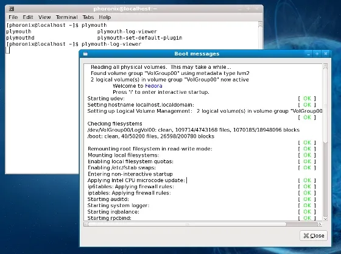
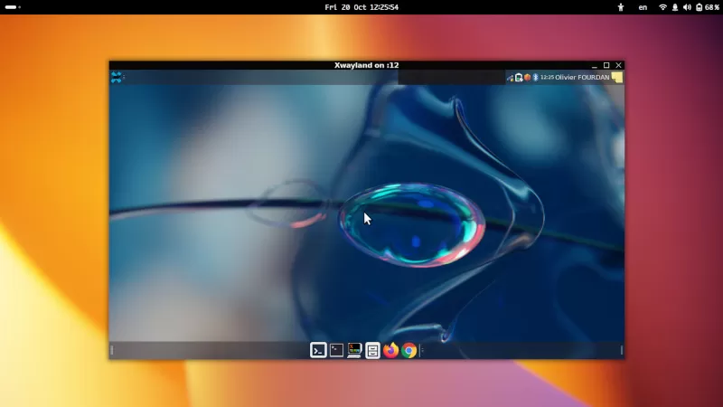

# 今日开源新闻汇总2024-3-26
## 新闻1
尽管大多数Linux发行版早已放弃SysVinit，转而采用systemd来执行初始化任务，但这个周末SysVinit 3.09版本发布了，适用于任何仍然喜欢System V初始化风格体验的遗留用户和坚持者。
 
SysVinit 3.09带来了两个主要变化：首先是增加了对使用musl C库构建的支持，作为GNU C库（glibc）的替代品。hddown辅助程序需要进行更改以启用musl支持。
 
第二个变化是增加了对重启命令的支持，使其能够在重启过程中向底层固件传递消息。这可以用于向固件传递信息，例如请求系统从另一个分区启动。SysVinit开发者考虑到了Raspberry Pi系统，添加了这项支持。SysVinit的重启程序增加了一个"-m"参数，用于将消息传递给固件。
 
此外，还有其他一些小的变化构成了SysVinit 3.09版本，如GitHub上所述。
 

## 新闻2
自去年以来，Red Hat的工程师们一直在开发xwayland-run和wlheadless-run，分别用于在其专用的XWayland rootful实例中生成X11客户端，以及在一组支持的Wayland headless合成器上运行Wayland客户端。其目的是改善Wayland headless体验，并能够通过rootful XWayland启动和运行经典的X11会话。今天发布了XWayland-Run v0.0.3版本。
 
xwayland-run 0.0.3的一个显著特点是为这些工具增加了对KDE的KWin合成器的支持。这个最新版本还带来了代码清理，现在Mutter基合成器在它们自己的D-Bus会话中运行，以及其他修复。
 
可以通过FreeDesktop.org GitLab下载xwayland-run 0.0.3更新的更多细节和这些辅助程序。
 

## 新闻3
