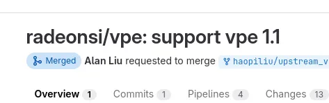
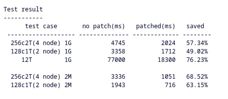
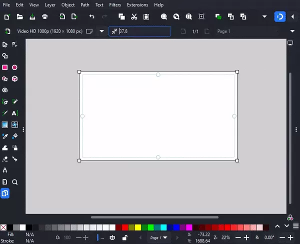

# 今日开源新闻汇总2024-3-26
## 新闻1
尽管大多数Linux发行版早已放弃SysVinit，转而采用systemd来执行初始化任务，但这个周末SysVinit 3.09版本发布了，适用于任何仍然喜欢System V初始化风格体验的遗留用户和坚持者。
 
SysVinit 3.09带来了两个主要变化：首先是增加了对使用musl C库构建的支持，作为GNU C库（glibc）的替代品。hddown辅助程序需要进行更改以启用musl支持。
 
第二个变化是增加了对重启命令的支持，使其能够在重启过程中向底层固件传递消息。这可以用于向固件传递信息，例如请求系统从另一个分区启动。SysVinit开发者考虑到了Raspberry Pi系统，添加了这项支持。SysVinit的重启程序增加了一个"-m"参数，用于将消息传递给固件。
 
此外，还有其他一些小的变化构成了SysVinit 3.09版本，如GitHub上所述。
 

## 新闻2
自去年以来，Red Hat的工程师们一直在开发xwayland-run和wlheadless-run，分别用于在其专用的XWayland rootful实例中生成X11客户端，以及在一组支持的Wayland headless合成器上运行Wayland客户端。其目的是改善Wayland headless体验，并能够通过rootful XWayland启动和运行经典的X11会话。今天发布了XWayland-Run v0.0.3版本。
 
xwayland-run 0.0.3的一个显著特点是为这些工具增加了对KDE的KWin合成器的支持。这个最新版本还带来了代码清理，现在Mutter基合成器在它们自己的D-Bus会话中运行，以及其他修复。
 
可以通过FreeDesktop.org GitLab下载xwayland-run 0.0.3更新的更多细节和这些辅助程序。
 

## 新闻3
Intel今天发布了其NPU Linux驱动程序用户空间组件的新版本，该组件与其iVPU加速器内核驱动程序一起使用，以启用其最新的Meteor Lake系统中的神经处理单元（NPU）。
 
新的Intel NPU Linux驱动程序1.2版本将oneAPI Level Zero支持提升到v1.16.1，Level Zero API支持已扩展，更加健壮，并且现在也可以针对外部Level Zero实现进行构建。1.2版本还更新了Intel NPU编译器代码（mtl_npu_ud_2024_08_rc3）、更新了Intel NPU固件（ci_tag_ud202408_vpu_rc_20240221_2101），以及其他各种内部更新和修复。总体来看，这个1.2更新主要是对他们的NPU驱动代码进行维护迭代，没有引入任何重大功能/改进。
 
Intel NPU Linux驱动程序支持继续主要与他们的OpenVINO AI工具包进行测试。对于那些想要了解Intel NPU Linux驱动程序堆栈概览的人，如果之前没有调查过的话（可以看这张图）：
 

 
Intel NPU Linux驱动程序1.2版本可以从GitHub下载，既有源代码形式，也有经过Ubuntu 22.04 LTS验证的Ubuntu（Debian）包二进制文件。
 
## 新闻4
上周，Tiny Corp因为对选择固件源代码的缺失和最终遇到的各种错误感到沮丧，决定暂停他们的AMD Radeon图形计算盒子项目。这并不是他们第一次暂停或完全放弃AMD Radeon图形计划。随着新一周的开始，他们计划重新引入AMD Radeon图形选项，与他们最近宣布的NVIDIA GeForce RTX 4090计算装置一起推出。
 
乔治·霍兹的Tiny Corp在一夜之间发推文说： 
 
*一个难以找到的“umr”仓库使得AMD tinybox变得可行。这将是一段旅程，但它给了我们调试的能力。*
 
*我们将同时销售两种，红色的15,000美元，绿色的25,000美元。当你实现你的预购时，你将选择你的颜色。网站已经更新。*
 
*如果你喜欢摆弄并且愿意承受痛苦，就买红色的。驱动程序仍然会导致GPU崩溃和有时挂起，但我们可以一起努力改进它。*
 
*我们将开始记录7900XTX GPU，并且我们将直接在tinygrad中使用KFD后端进入内核。同时，也期待AMD的公告，这不是我们要求的一切，但这是一个开始。*
 
*如果你想要“即插即用”，就买绿色的。你需要支付税费，但它非常稳定。关于它没有太多可说的。与其他地方更昂贵的6x4090盒子相比。*
 
*希望我们能在6月的MLPerf上看到tinybox的两种颜色。*
 
因此，由于发现了UMR调试器，他们能够更好地处理一些他们遇到的Radeon GPU问题。UMR可能没有很好的市场推广，因此可能较难找到，但它并不是新东西。七年前，我就写过AMD开源他们的UMR调试器的文章，自2017年首次亮相以来，我还报道了更多他们对这个Linux用户空间AMD图形调试器的UMR调试改进。
 
他们曾经探索了几天的Intel Arc Graphics可能性，但至少截至今天，他们的计划是推出AMD Radeon和NVIDIA GeForce驱动的计算“Tinybox”系统：
 

 
对于感兴趣的人，Tinygrad.org上有更多详情。
 
## 新闻5
去年夏天发布的AMD开源Linux驱动程序补丁启用了新的“VPE”IP块，作为未来AMD GPU的通用复制引擎。这个VPE块可能会在即将到来的AMD RDNA3.5更新（RDNA3+）集成显卡中首次亮相，但无论如何，AMD已经在开发逐步改进的VPE 1.1 IP，现在已经得到了Mesa 24.1 RadeonSI驱动代码的支持。
 
新的VPE 1.1引擎可能用于即将推出的RDNA4图形处理器，因为我们最近已经看到更多的IP启用，这些IP似乎注定用于下一代Radeon图形处理器，带有GFX12。VPE 1.1似乎只是VPE 1.0的小更新，但增加了一个新的“协作同步”命令用于这个复制引擎。
 
这次合并将VPE 1.1支持加入到了Mesa 24.1的RadeonSI Gallium3D驱动中。无论如何，看到AMD继续为新的Radeon图形处理器进行早期的开源上游支持，这是非常好的。
 

## 新闻6
Linux 6.9内核将能够更快地启动具有大量内存的系统——特别是使用HugeTLB页面——比以前的内核快得多，从而显著减少了启动时间。
 
作为Linux 6.9合并窗口内存管理（MM）更新的一部分，合并了一组补丁，用于在启动时并行初始化HugeTLB页面。对于具有大量HugeTLB页面的系统，这可以显著减少启动时间。
 
字节跳动的Linux开发者李刚（Gang Li）投入了大量时间在补丁系列上进行多轮审查，以使HugeTLB页面初始化工作正常。李刚在之前的补丁系列中解释说：
 
*“启动期间的HugeTLB初始化占用了相当多的时间。例如，在一个2TB的系统上，初始化1800个1GB的巨页需要1-2秒，占总启动时间的10秒。在一个12TB的英特尔主机上初始化11,776个1GB的巨页需要超过1分钟。这是一个值得注意的数字。*
 
*受到延迟页面初始化并行化和跳过巨型尾部结构页面初始化的启发，HugeTLB初始化也可以通过并行化来加速。内核已经有像padata_do_multithreaded这样的基础设施，这个补丁使用它通过最小的修改来实现有效的结果。”*
 
对于具有大量HugeTLB页面的非常大的服务器，这可以带来显著的启动时间节省：
 

 
对于通常在超大规模计算和其他大型组织中的这些更大的服务器，服务可用性和系统运行时间至关重要，因此在需要系统重启的情况下，更快的启动时间具有重大的好处。
 
## 新闻7
Inkscape 的最新上游开发代码已经过渡到使用 GTK4 工具包。
 
Inkscape 图形程序的最新开发代码正在使用 GTK4 而不是 GTK3。这对这个著名的开源艺术家程序来说是一个重大升级，它也带来了一些不错的架构改进，并且正在努力实现未来的适当 GPU 加速。
 
Inkscape 通过他们的 Mastodon 账户宣布了这个周末过渡到 GTK3。由于 macOS 和 Windows 上的各种问题，下一个稳定版本（v1.4）仍将使用 GTK3。这些 Windows/macOS 问题仍在解决中，因此希望 GTK4 版的 Inkscape 将为其后续版本做好充分准备。
 
（图片为目前的Inkscape GTK3 界面）
 

## 新闻8
