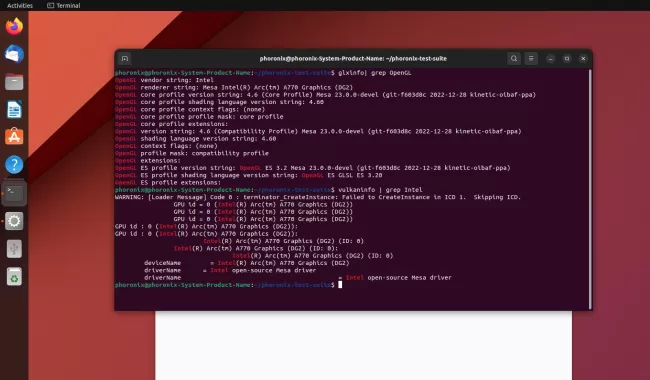
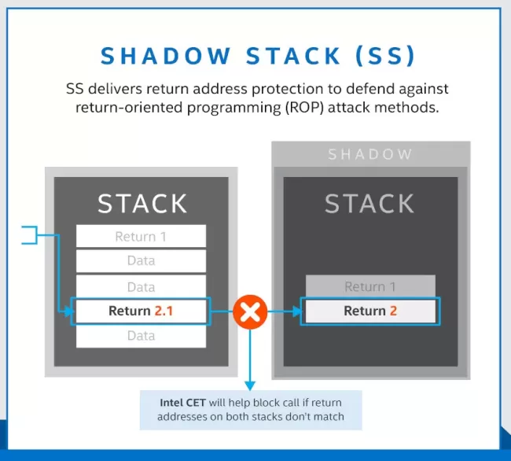
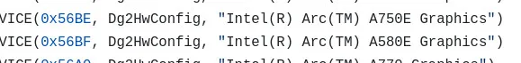

# 今日开源新闻汇总2024-3-27
## 新闻1
开源的 Panthor DRM 驱动程序支持更新的 Arm Mali GPU，已在 3 月初排队进入 drm-misc-next，准备合并到 Linux 6.9。但最终没有在 Linux 6.9 合并窗口前被拉入 DRM-Next，因此被推迟到 Linux 6.10 周期。不过，本周该驱动程序和其他更改开始为 Linux 6.10 排队。
 
首次为 Linux 6.10 准备的 drm-misc-next 拉取已完成。这次拉取使得支持新型 Mali 图形“Gen10”的 Panthor DRM 驱动程序落地，这些图形依赖于命令流前端（CSF）。与此同时，Mesa 24.1 也进行了 Gallium3D 驱动程序的更改，以支持这个新的内核图形驱动程序。Mali GPU 支持也有新的固件要求。
 
除了引入 Panthor 驱动程序外，这次 drm-misc-next 拉取还包括改进 TTM 缓冲对象在空闲/繁忙处理中的放置、一个新的 CONFIG_DRM_WERROR 选项用于将 DRM 子系统代码的警告设置为错误，以及其他各种核心改进。较小的直接渲染管理器驱动程序也进行了一些小修复。
 
在组织方面，DRM-Misc 现已过渡到使用 GitLab 和 FreeDesktop.org 托管。
 
请查看这次拉取，了解初步为 Linux 6.10 准备的 DRM-Misc-Next 材料，预计在今年夏天。
 
## 新闻2
Intel维护的通用VA-API库"libva"的工程师们今天发布了2.21版本，为这个视频加速API支持带来了几项修复和添加。
 
通用的libva 2.21库增加了一个驱动程序名称映射，以支持新的Intel Xe内核模式驱动程序。Intel Xe已合并到Linux 6.8中，并且是Lunar Lake之前几代的实验性驱动选项。现在，随着libva 2.21的发布，为使用Xe驱动程序的用户提供了适当的映射，而不是现有的i915驱动程序。
 

 
Libva 2.21还在AV1编码代码中添加了allow_content_tools和force_intger_mv，各种针对Windows平台的特定修复/添加，当所有Wayland后端失败时的修复，持续集成（CI）更新，以及各种构建更新。
 
通过GitHub下载和查看libva 2.21 VA-API库更改的完整列表。
 
## 新闻3
在Linux 6.6版本中，作为Intel控制流执行技术（CET）的一部分，Shadow Stack支持终于被合并。这项历经数年的努力使得新一代Intel处理器能更好地防御ROP攻击。对于Linux 6.10版本，Shadow Stack的支持将扩展到x32。
 
尽管x32 ABI并不十分常见，但它仍然存在。作为提醒，这个Linux ABI提供了x86_64的好处，同时仍然依赖于32位指针。它相对于x86 32位的优势在于能够利用x86_64增加的寄存器集、浮点改进等，但仍然依赖于32位指针，并且每个进程的内存限制为4GB。
 
十年前，x32 ABI听起来非常不错，但如今在实际应用中很少听到有关x32的消息，大多数用户对x86_64感到满意。甚至偶尔有人呼吁是否应该弃用x32。不过，令人惊讶的是，我们现在看到Shadow Stack支持x32。
 

 
目前在TIP.git的"x86/shstk"分支中排队的是为x32添加shadow stack支持。这一支持已经在使用Intel Tiger Lake系统的x32上成功测试，由Intel工程师H.J. Lu进行。现在它已经在TIP分支中，很可能会在今年夏天提交到Linux 6.10内核周期。总之，看到Intel在2024年为Linux x32支持做出改进，这确实有些意外。
 
## 新闻4
Intel今天发布了驱动程序补丁，为其Xe和i915 Linux内核图形驱动程序的DG2/Alchemist系列添加了两个新的PCI ID。
 
在过去两年多的时间里，他们的开源Linux图形驱动程序代码中已经积累了各种DG2 PCI ID，今天早上又有两个新的PCI ID以补丁形式出现，用于i915和Xe Linux DRM驱动程序。
 
新的PCI ID是0x56BE和0x56BF。经过一些搜索，在Intel Compute Runtime代码中找到了这两个ID，0x56BE是Intel Arc Graphics A750E变体，而0x56BF是Intel Arc Graphics A580E。关于Arc Graphics A580E和A750E变体，公开的信息不多，所以我们可能很快就会随着驱动程序支持的出现而了解更多。
 

 
对于i915和Xe内核图形驱动程序，根据补丁，只需要新的PCI ID，无需在现有的DG2/Alchemist代码路径上进行其他驱动更改。通常，PCI ID的添加被视为当前（v6.9）内核周期的“修复”的一部分，是比较安全的，或者可能会推迟到v6.10，这取决于Intel是否急于推出新的硬件支持。
 
## 新闻5
