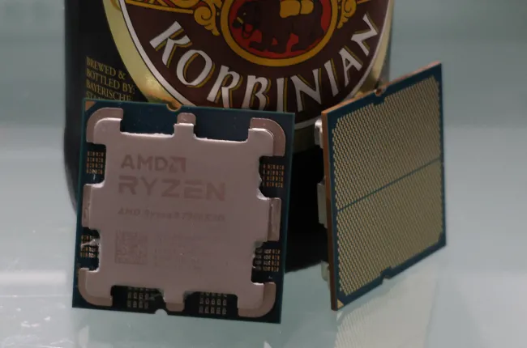
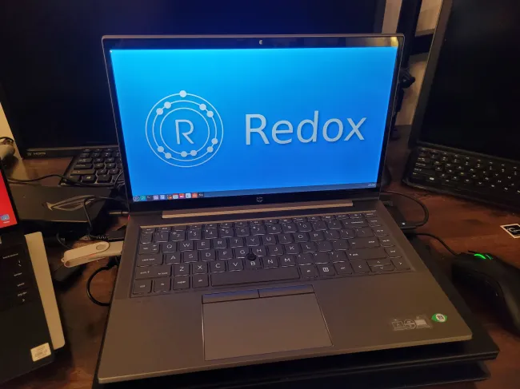
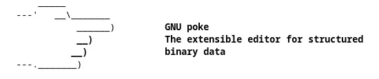
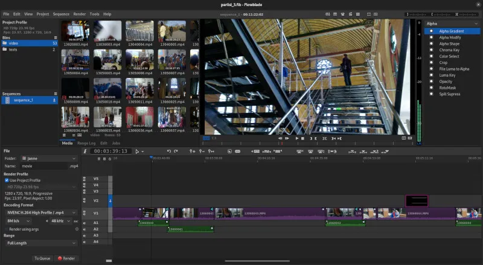
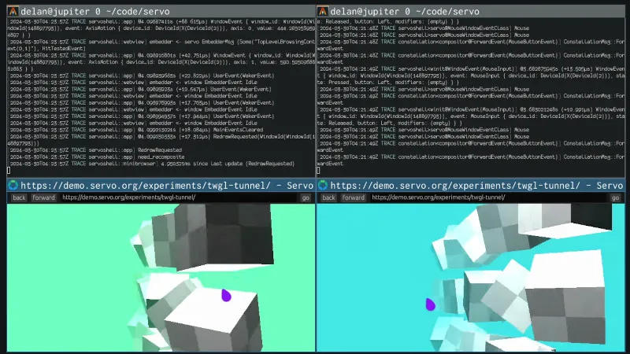

# 今日开源新闻汇总2024-4-1
## 1.
Mozilla Ocho小组在复活节周日发布了Llamafile的新版本。Llamafile是一种分发和运行大型语言模型（LLM）的方法，只需一个文件，使得LLM更容易被开发者和最终用户使用。Llamafile是Mozilla近期推出的较有趣的非浏览器项目之一，目前看来前景光明。
 
Llamafile通过利用Llama.cpp，使得处理大型语言模型变得更加方便，易于部署。它可以轻松地将整个LLM打包成一个单文件可执行程序，该程序适用于大多数系统，同时能够利用CPU和GPU执行。
 
今天发布的Llamafile 0.7终于支持AVX-512了！在AVX-512启用的CPU上，如AMD Zen 4，测试Llama 0.7的人发现，这种支持使得提示评估时间快了大约10倍。对于那些拥有AVX-512并在CPU上使用Llamafile进行大型语言模型的人来说，这是一个非常好的复活节礼物。
 
我已经运行了几个月的Llamafile基准测试，并期待尝试Llamafile 0.7，以查看其在AVX-512 Intel和AMD处理器上的性能提升。
 
Llamafile 0.7还带来了BF16 CPU支持、安全修复、各种Windows改进、在Raspberry Pi 5上使用F16权重的提示评估速度现在快了大约8倍，以及其他各种改进。
 
更多关于Llamafile 0.7的下载和信息，请通过GitHub获取。
 

 
## 2.
开源的Rust编写的Redox OS最近在其内核上取得了“显著”的性能和正确性改进，进一步展示了这个从零开始的操作系统的能力。
 
Redox OS已经正确地布线了TLB shootdown支持，改进了信号处理以处理各种bug，需求分页在某些情况下帮助实现了“巨大的性能提升”，新的p2buddy帧分配器已经推出，以及其他各种低级优化，如系统调用优化。
 
最新的Redox OS状态更新总结道： 
 
*“今年，内核的正确性和原始性能都有了许多改进。信号和TLB shootdown MRs显著提高了内核内存的完整性，并可能消除了许多难以调试和非平凡的heisenbugs。尽管如此，为了提高与移植应用程序的兼容性，仍有很多工作要做，以优化和修复relibc中的bug，最重要的是，更接近一个自托管的Redox。”*
 
Redox OS项目一如既往地令人兴奋。
 

 
## 3.
GNU Poke 4.0在开发了一年后发布，它增强了这款开源软件，作为一个交互式的二进制数据编辑器，并附带了自己的过程式编程语言。
 
GNU Poke 4.0带来了许多用户界面更新，一个新的“pokefmt”工具用于简单的模板系统，各种Poke语言更新，库更新，更新了用于处理不同形式二进制数据的pickles，以及原生Windows构建支持。GNU Poke现在支持在Microsoft Windows系统上构建和运行poke、libpoke和pokefmt。
 
关于GNU Poke 4.0发布的更多细节可以通过邮件列表公告获得。
 
开发者Jose E. Marchesi在周六还发布了poke-elf 1.0。Poke-ELF 1.0是这个项目的首个版本，是一个功能齐全的GNU Poke pickle，用于编辑ELF对象文件、可执行文件、共享库和核心转储。Poke-ELF 1.0支持多种架构和扩展，并作为GNU Poke项目的一部分正在开发。
 

 
## 4.
最新版本的Flowblade，一个开源的Linux视频编辑器，已于本周末发布。Flowblade带来了一些新功能，同时升级到GTK4工具包的工作仍在进行中，希望能在2025年准备就绪。
 
Flowblade 2.14新增了对USB操纵杆/快进快退支持的支持，目前已支持Contour Design ShuttlePRO v2、Contour Design ShuttleXpress和Contour A/V Solutions SpaceShuttle设备。
 
Flowblade 2.14还新增了可编辑的标题剪辑，支持在播放头位置粘贴剪辑，图形剪辑现在可以被拖动到任意长度，慢动作视频播放现在可用，以及各种滤镜更新。除了增强现有滤镜外，这个新版本还新增了弹性扭曲和音频压缩滤镜。Flowblade 2.14还修复了许多错误。
 
在GitHub上可以下载更多关于新版Flowblade 2.14视频编辑器的详情。
 
发布说明还概述了GTK4用户界面移植的当前进行中的工作：
 
*“我们已经移除了几乎所有的Gtk.Menu实例。我们花了一些时间进行大部分脚本化的测试转换，以全面探索所需的更改。所需的工作看起来相当可行，我们将能够使用脚本完成大部分转换工作，但有一些障碍需要解决，这与GTK4不再拥有每个小部件XWindows有关。目前看来，GTK4移植将在2025年某个时候完成。”*
 
所以希望明年我们能看到一个GTK4版的Flowblade视频编辑器。
 

 
## 5.
自2019年起开发至今，庞大的NetBSD 10.0版本今天作为一个美妙的复活节惊喜发布了。
 
NetBSD 10提供了WireGuard支持，支持许多新的Arm平台，包括Apple Silicon和更新的Raspberry Pi板，一种新的Intel以太网驱动，支持Realtek 2.5GbE网络适配器，SMP性能改进，自动交换加密，以及过去4年多积累的大量其他硬件支持改进。此外，NetBSD 10在修复bug和性能优化方面也不缺乏。2020年对NetBSD 10.0开发版的一些测试显示，当时它已经比NetBSD 9快了12%。
 
NetBSD 10.0还改进了混合系统的调度器性能，各种系统调用优化，更快的启动性能，增强的虚拟化支持等。NetBSD 10.0是这个BSD操作系统的一个彻底巨大的更新。
 
更多关于NetBSD 10.0发布的详情，请通过NetBSD.org下载。
 
## 6.
Linux Foundation Europe的管理下，Servo Web引擎在Igalia和其他开发者的持续贡献下，继续保持着非常活跃的一年。参与的开源开发者们正忙于将这个用Rust编写的网页布局引擎打造成良好状态，以便可能作为其他软件的嵌入式友好解决方案。
 
Servo项目今天发布了他们2024年3月的月度状态更新，突出展示了过去一个月的所有进展。一些3月份的亮点包括：
 
Servo现在已经超越了整套Web平台测试中的传统布局引擎。
 
对WOFF2网络字体的支持。
 
对box-shadow、text-shadow、conic-gradient()、repeating-conic-gradient()等CSS特性的支持。
 
HTML表格支持现在在Servo中默认启用。
 
各种2D画布的改进。
 
WebRender、Stylo、SpiderMoney和GStreamer都已升级。
 
开发工具已更新，以确保支持WebM和AV1内容。
 
继续努力使Servo引擎易于嵌入。
 
Servo参与了Outreachy，并且得益于这些贡献者，代码得到了改进和clippy错误修复，以及其他工作。
 
更多关于Servo网页引擎在2024年3月的进展详情，可以通过Servo.org博客找到。
 

 
## 7.
