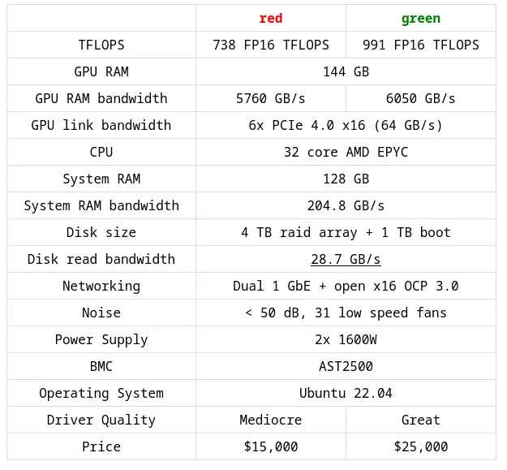
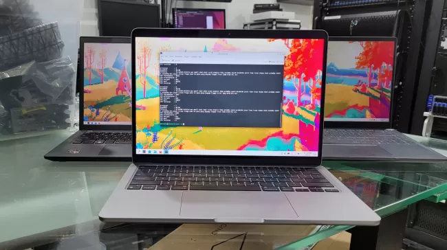
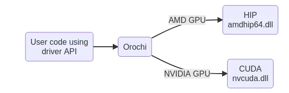
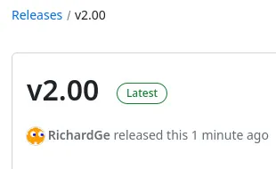
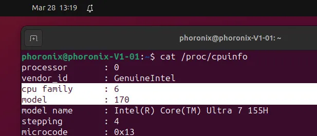
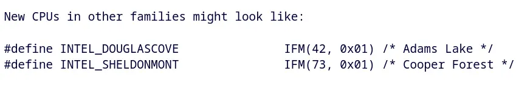
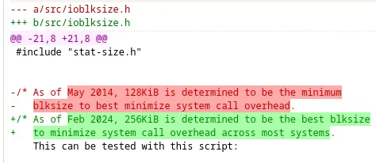
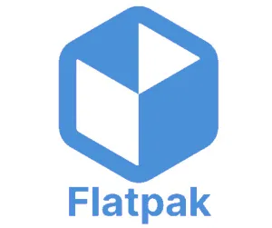
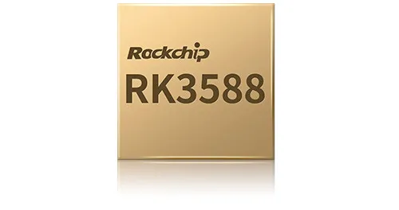

# 今日开源新闻汇总2024-4-1
# 这四五天时间因为出差事情多四处奔波，加上身体和心理出现一些异常情况，我已经加大了用药。控制住了。所以有时间休息就把前几天没做的文章给补上了。所以今天的资讯文章很多是前几天落下的，一起补上去了。今天一共17篇文章。闲暇时间慢慢品读吧。祝阅读愉快开心每一天 :)
# 另外这几天的国外开源资讯是不止这里文章展示的才这么点的，有些我做成了视频，我这几年一直有B站，[地址是这个](https://space.bilibili.com/361507283)。我每天的话正常情况下不是很忙或生病的情况下，每天是博客和视频都会有更新一些的。所以大家敬请留意哦。
## 1.
Mozilla Ocho小组在复活节周日发布了Llamafile的新版本。Llamafile是一种分发和运行大型语言模型（LLM）的方法，只需一个文件，使得LLM更容易被开发者和最终用户使用。Llamafile是Mozilla近期推出的较有趣的非浏览器项目之一，目前看来前景光明。
 
Llamafile通过利用Llama.cpp，使得处理大型语言模型变得更加方便，易于部署。它可以轻松地将整个LLM打包成一个单文件可执行程序，该程序适用于大多数系统，同时能够利用CPU和GPU执行。
 
今天发布的Llamafile 0.7终于支持AVX-512了！在AVX-512启用的CPU上，如AMD Zen 4，测试Llama 0.7的人发现，这种支持使得提示评估时间快了大约10倍。对于那些拥有AVX-512并在CPU上使用Llamafile进行大型语言模型的人来说，这是一个非常好的复活节礼物。
 
我已经运行了几个月的Llamafile基准测试，并期待尝试Llamafile 0.7，以查看其在AVX-512 Intel和AMD处理器上的性能提升。
 
Llamafile 0.7还带来了BF16 CPU支持、安全修复、各种Windows改进、在Raspberry Pi 5上使用F16权重的提示评估速度现在快了大约8倍，以及其他各种改进。
 
更多关于Llamafile 0.7的下载和信息，请通过GitHub获取。
 

 
## 2.
开源的Rust编写的Redox OS最近在其内核上取得了“显著”的性能和正确性改进，进一步展示了这个从零开始的操作系统的能力。
 
Redox OS已经正确地布线了TLB shootdown支持，改进了信号处理以处理各种bug，需求分页在某些情况下帮助实现了“巨大的性能提升”，新的p2buddy帧分配器已经推出，以及其他各种低级优化，如系统调用优化。
 
最新的Redox OS状态更新总结道： 
 
*“今年，内核的正确性和原始性能都有了许多改进。信号和TLB shootdown MRs显著提高了内核内存的完整性，并可能消除了许多难以调试和非平凡的heisenbugs。尽管如此，为了提高与移植应用程序的兼容性，仍有很多工作要做，以优化和修复relibc中的bug，最重要的是，更接近一个自托管的Redox。”*
 
Redox OS项目一如既往地令人兴奋。
 

 
## 3.
GNU Poke 4.0在开发了一年后发布，它增强了这款开源软件，作为一个交互式的二进制数据编辑器，并附带了自己的过程式编程语言。
 
GNU Poke 4.0带来了许多用户界面更新，一个新的“pokefmt”工具用于简单的模板系统，各种Poke语言更新，库更新，更新了用于处理不同形式二进制数据的pickles，以及原生Windows构建支持。GNU Poke现在支持在Microsoft Windows系统上构建和运行poke、libpoke和pokefmt。
 
关于GNU Poke 4.0发布的更多细节可以通过邮件列表公告获得。
 
开发者Jose E. Marchesi在周六还发布了poke-elf 1.0。Poke-ELF 1.0是这个项目的首个版本，是一个功能齐全的GNU Poke pickle，用于编辑ELF对象文件、可执行文件、共享库和核心转储。Poke-ELF 1.0支持多种架构和扩展，并作为GNU Poke项目的一部分正在开发。
 

 
## 4.
最新版本的Flowblade，一个开源的Linux视频编辑器，已于本周末发布。Flowblade带来了一些新功能，同时升级到GTK4工具包的工作仍在进行中，希望能在2025年准备就绪。
 
Flowblade 2.14新增了对USB操纵杆/快进快退支持的支持，目前已支持Contour Design ShuttlePRO v2、Contour Design ShuttleXpress和Contour A/V Solutions SpaceShuttle设备。
 
Flowblade 2.14还新增了可编辑的标题剪辑，支持在播放头位置粘贴剪辑，图形剪辑现在可以被拖动到任意长度，慢动作视频播放现在可用，以及各种滤镜更新。除了增强现有滤镜外，这个新版本还新增了弹性扭曲和音频压缩滤镜。Flowblade 2.14还修复了许多错误。
 
在GitHub上可以下载更多关于新版Flowblade 2.14视频编辑器的详情。
 
发布说明还概述了GTK4用户界面移植的当前进行中的工作：
 
*“我们已经移除了几乎所有的Gtk.Menu实例。我们花了一些时间进行大部分脚本化的测试转换，以全面探索所需的更改。所需的工作看起来相当可行，我们将能够使用脚本完成大部分转换工作，但有一些障碍需要解决，这与GTK4不再拥有每个小部件XWindows有关。目前看来，GTK4移植将在2025年某个时候完成。”*
 
所以希望明年我们能看到一个GTK4版的Flowblade视频编辑器。
 

 
## 5.
自2019年起开发至今，庞大的NetBSD 10.0版本今天作为一个美妙的复活节惊喜发布了。
 
NetBSD 10提供了WireGuard支持，支持许多新的Arm平台，包括Apple Silicon和更新的Raspberry Pi板，一种新的Intel以太网驱动，支持Realtek 2.5GbE网络适配器，SMP性能改进，自动交换加密，以及过去4年多积累的大量其他硬件支持改进。此外，NetBSD 10在修复bug和性能优化方面也不缺乏。2020年对NetBSD 10.0开发版的一些测试显示，当时它已经比NetBSD 9快了12%。
 
NetBSD 10.0还改进了混合系统的调度器性能，各种系统调用优化，更快的启动性能，增强的虚拟化支持等。NetBSD 10.0是这个BSD操作系统的一个彻底巨大的更新。
 
更多关于NetBSD 10.0发布的详情，请通过NetBSD.org下载。
 
## 6.
Linux Foundation Europe的管理下，Servo Web引擎在Igalia和其他开发者的持续贡献下，继续保持着非常活跃的一年。参与的开源开发者们正忙于将这个用Rust编写的网页布局引擎打造成良好状态，以便可能作为其他软件的嵌入式友好解决方案。
 
Servo项目今天发布了他们2024年3月的月度状态更新，突出展示了过去一个月的所有进展。一些3月份的亮点包括：
 
Servo现在已经超越了整套Web平台测试中的传统布局引擎。
 
对WOFF2网络字体的支持。
 
对box-shadow、text-shadow、conic-gradient()、repeating-conic-gradient()等CSS特性的支持。
 
HTML表格支持现在在Servo中默认启用。
 
各种2D画布的改进。
 
WebRender、Stylo、SpiderMoney和GStreamer都已升级。
 
开发工具已更新，以确保支持WebM和AV1内容。
 
继续努力使Servo引擎易于嵌入。
 
Servo参与了Outreachy，并且得益于这些贡献者，代码得到了改进和clippy错误修复，以及其他工作。
 
更多关于Servo网页引擎在2024年3月的进展详情，可以通过Servo.org博客找到。
 

 
## 7.
George Hotz的Tiny Corp在暂停了他们的AMD GPU驱动的Tinybox后，几天后决定为Tinybox计算系统提供AMD和NVIDIA图形选项，并现在分享了这些计划中的“绿色”和“红色”Tinybox设计的更多规格。
 
两款Tinybox计算机都将使用未命名的AMD EPYC 32核处理器、128GB的系统RAM、4TB RAID阵列和冗余的1600瓦电源。不同之处在于图形卡，红色版本预计仍将采用Radeon RTX 7900 XTX，而绿色版本将采用NVIDIA GeForce RTX 4090图形卡。Tinybox将符合机架的12U高度要求。
 
Tinybox Red的零售价为15,000美元，而Tinybox Green的零售价为25,000美元。配备Radeon图形卡的红色版本被描述为具有“中等”图形驱动质量，而NVIDIA专有驱动堆栈提供“优秀”的驱动质量。Ubuntu 22.04 LTS将为这些Tinybox系统提供动力。Tiny Corp在推特上表示，他们预计首批系统将在四月底发货，现已可以预订，需支付100美元定金。他们在Twitter/X上的一次回应中分享说，由于缺乏具有足够视频内存带宽的Intel独立显卡，目前没有Intel Arc Graphics选项。
 
有兴趣的人可以通过Tinygrad.org找到更多关于这些高性能Linux计算设备的详细信息。
 

 
## 8.
Flax Engine 1.8的新版本已经发布，这是一个开源游戏引擎，非商业和教育用途可以免费使用，但商业游戏需要支付4%的版税。
 
Flax Engine 1.8的更新带来了全新的用户界面编辑器，支持.NET SDK 8和C# 12，终于支持ASTC纹理压缩，这在减少移动设备的纹理内存使用方面尤其有用，新的车辆功能包括对坦克车辆的支持，样条线改进，新的编辑器功能等。
 
以下是一些官方的 Flax Engine 屏幕截图，供不熟悉此游戏引擎的人使用：
 

 

 
Flax Engine 1.8可以从GitHub下载。更多关于Flax Engine 1.8更新的信息，请访问FlaxEngine.com博客。
 
## 9.
Asahi AGX Gallium3D驱动程序的主要开发者Alyssa Rosenzweig已经完成了一次重大的同步，将这个开源Apple Silicon OpenGL图形驱动程序更新到即将发布的Mesa 24.1版本。
 
在即将到来的Mesa 24.1分支之前，这次同步为这个Apple Silicon用户空间驱动程序带来了123个新的补丁。这次最新的上游同步增加了一个Braun-Hack溢出处理器，一个前置/后置系统以消除几乎所有的着色器变体，以及一个常量提升优化过程，以帮助许多压力受限工作负载的性能。还添加了一个快速链接器和其他各种优化。
 
总的来说，周五晚上的合并增加了6.4k行新的驱动代码，同时移除了2.3k行现有代码。这些Asahi AGX性能优化和其他工作将在大约两个月后作为Mesa 24.1的稳定版本发布。
 

 
## 10.
在本周的“KDE本周动态”开发总结中，开发者Nate Graham重点介绍了可选择加入的DrKonqi崩溃报告向导。部分归功于这种可选择加入的自动崩溃报告，本周收集了一些细节，用于修复Plasma 6中至少三个重要的崩溃问题。
 
除了更多的KDE崩溃修复之外，本周在KDE中完成的其他工作包括：
 
桌面上下文菜单和全局编辑模式工具栏中的一些菜单项和工具栏按钮更加简洁。
 
为不使用systemd启动的人修复了电源和会话操作（再次）。
 
将设置同步到SDDM现在也会在KWin作为Wayland服务器运行的系统上正确同步缩放因子和屏幕布局。
 
Discover在显示应用程序评价方面变得更快。
 
Discover在呈现大型离线更新信息方面变得更快。
 
Baloo不再尝试索引临时挂载的文件系统（如网络共享）上的内容。
 
至于本周的崩溃修复，有一个在刷新KNewStuff内容时Discover的崩溃修复，某些情况下启动时Discover的崩溃，改变某些设置下面板位置时Plasma的崩溃，以及在创建或重命名文件或文件夹时Baloo文件索引器的崩溃。
 
更多关于本周KDE变化的细节可以通过Nate Graham的博客获得。
 
## 11.
AMD GPUOpen的Orochi项目是一个努力，允许在Radeon HIP和NVIDIA CUDA API之间进行动态运行时切换，以实现更好的跨GPU可移植性。今天标志着Orochi 2.0的可用性，用于增强这个API以针对NVIDIA CUDA和AMD HIP硬件。
 
AMD的Orochi不应与AMD之前资助的ZLUDA混淆，ZLUDA是一个建立在ROCm之上的即插即用CUDA实现。相反，Orochi是它自己的API，反过来可以在运行时从单个二进制文件中针对NVIDIA CUDA和AMD HIP使用。应用程序需要被适配以使用Orochi。
 
随着刚刚发布的Orochi 2.0，与Orochi 1.0相比，实现了"更多"的CUDA和HIP函数。发布公告称，Orochi 2.0的函数覆盖率应该是"几乎穷尽的"。
 
Orochi 2.0还带来了Direct3D 12互操作性以及纹理的新演示。Orochi 2.0还改进了HIP和CUDA之间的绑定和命名，以获得更好的可维护性。
 
将现有的Orochi 1.x应用程序移植到使用Orochi 2.0 API被描述为直接且变化最小。
 
通过GitHub可以下载AMD的Orochi 2.0发布的更多详情。
 

 

 
## 12.
自90年代中期以来，随着P6微架构为Pentium Pro的第六代x86微架构，Intel一直依赖于“Family 6”CPU ID。从那时起，Intel只是在Family 6内为每个新的微架构/核心增加了型号号码。例如，Meteor Lake是Family 6 Model 170，Emerald Rapids是Family 6 Model 207。这种CPU ID识别在Linux内核和其他操作系统中用于识别CPU代以进行正确处理等。但是Intel Linux工程师今天透露，Family 6即将在“不久”的将来结束。
 
由于Intel几十年来一直依赖于“Family 6”，Linux内核代码专门处理Family 6，并且只期望通过模型ID比较来检查Intel CPU代/核心。另一方面，AMD定期调整他们的Family ID，例如Zen / Zen 2是Family 23，Zen 3 / Zen 4是Family 25，现在Zen 5是Family 26。但由于Intel即将结束Family 6，他们现在需要重新工作大量的CPU ID检查以确保未来的兼容性，同时继续处理现有的Intel处理器。
 

 
目前已经准备了一组74个补丁来调整Intel CPU ID家族识别和Intel未来使用CPUID(1).EAX中扩展家族字段的非零值的计划。Linux内核补丁消息指出，Intel结束使用Family 6的过渡将在“不久”的将来到来。
 
除了评论说这将在“不久”的将来发生，在清理Intel CPU ID Linux代码时，有一些例子提到新的CPU可能属于其他家族，可能是Douglas Cove / Adams Lake和Intel Sheldonmont / Cooper Forest。
 
Douglas Cove和Sheldonmont核心名称是新的披露，除非是随机占位符，Adams Lake和Cooper Forest虽然与Intel的命名惯例相符。在Arrow Lake和Lunar Lake之后是Panther Lake，所以如果Adams Lake确实是一个真实的代号，它至少会在2026年出现，并将接替Panther Lake。与此同时，在Xeon E Sierra Forest之后是Clearwater Forest，所以Cooper Forest可能是Clearwater Forest的继任者。同时，根据早期的Intel Linux内核补丁，已经知道Clearwater Forest将是Family 6 Model 221，Lunar Lake将是Family 6 Model 189。所以至少在这些代中Family 6还在继续。
 

 
这一系列补丁开始了调整Linux内核代码的征程，为未来超越“Family 6”标识的Intel CPU做准备。这是一个正在进行的努力，可能会在未来几个月内解决，并在这些未来的处理器超越Family 6时代之前上游到Linux内核。
 
考虑到事情的发展时机和Intel目前正在进行的一系列基本改进，我不禁想知道这个后Family 6时代是否会与拥抱Intel X86S、Intel FRED和其他重大变化的一代同步。如果是这样，2026~2027年应该会非常令人兴奋。
 
## 13.
GNU Coreutils 9.5的新版本今天发布，带来了更多的功能改进和错误修复，包括一个存在已久的chmod问题的安全修复。
 
值得注意的是，GNU Coreutils 9.5中的cp、mv、install、cat和split命令现在可以一次读/写至少256KiB。以前的最小值是128KiB，现在已经翻倍，以提高现代系统上Coreutils的吞吐量。由于这一变化，Coreutils 9.5在读取现代系统上缓存的文件时，吞吐量提高了10~20%。这一优势来自于减少系统调用开销。这个默认I/O大小的更新是十年前最后一次调整的。
 
在安全方面，GNU Coreutils 9.5修复了递归chmod（chmod -R）的竞态条件，攻击者可以用符号链接替换遍历的文件，从而导致chmod操作非预期的文件。这个自Coreutils开始就存在的错误现在已经修复。
 
GNU Coreutils 9.5还修复了与CIFS文件系统交互时的各种警告，join和uniq更好地处理多字节字符，tail不再错误处理来自/proc和/sys文件系统的输入，不同命令的各种新选项，SELinux在文件复制操作期间的操作现在更高效，而且tail现在可以通过重复的"–pid"选项跟踪多个进程。
 
更多关于GNU Coreutils 9.5变化的详细信息可以通过发布公告获得。
 

 
## 14.
Simon McVittie在周三发布了Flatpak 1.15.7预发布版，这个广泛使用的开源应用程序沙盒和分发框架带来了一些显著的变化。
 
Flatpak作为领先的应用程序沙盒和分发解决方案，继续在许多不同的Linux发行版中得到很好的发展，与Flathub配合，使得应用程序访问非常容易。Flatpak 1.15.7引入了自动移除过时驱动版本和其他自动修剪的引用的能力。这将通过自动移除不再使用的寿命终止的运行时来帮助消除随时间积累的多余包袱。随着系统更新使用新的驱动程序/运行时，旧的可以被自动移除。
 
Flatpak 1.15.7还增加了"–socket=inherit-wayland-socket"参数，以继承现有的Wayland套接字环境，并在安装或升级应用程序时自动重新加载D-Bus会话总线配置，以确保任何导出的D-Bus服务被识别。
 
Flatpak 1.15.7还取消了对现有Autotools构建系统的支持，转而支持Meson。Meson构建系统对Flatpak来说效果很好，现在是唯一的构建系统，类似于许多其他开源项目放弃Autotools转向Meson。
 
这次Flatpak更新还包括了许多错误修复，范围从D-Bus和Wayland问题到修复内存泄漏、改进异步信号安全性和文档改进。
 
更多关于Flatpak 1.15.7开发版的详细信息可以通过GitHub获得。
 

 
## 15.
今天，一位Intel工程师发布的补丁允许通过在虚拟化领域使用的VirtIO DRM驱动程序，从其他设备导入扫描缓冲区。从其他设备/驱动程序导入扫描缓冲区可以通过避免过多的复制来实现更有效的使用。
 
今天发布了一组七个补丁，允许通过VirtIO DRM从其他设备导入扫描缓冲区。有了QEMU DMA-BUF支持，这意味着在扫描缓冲区在主机上本地显示并且已经在vRAM中之前，就可以避免复制，然后编码并流式传输到远程客户端以供其他用例使用。
 
Intel工程师Vivek Kasireddy解释了这些VirtIO DRM补丁： 
 
*“让virtio-gpu从其他设备导入扫描缓冲区（通过prime）意味着我们将为分配给Guest VM的无头GPU添加一个头，或者为通过的常规GPU设备添加额外的头。在这些情况下，Guest合成器可以使用主GPU渲染到扫描缓冲区，并让次级GPU（virtio-gpu）导入它以用于显示目的。*
 
*这样做的主要优势是，导入的扫描缓冲区可以在主机上本地显示（例如，使用Qemu + GTK UI），或者编码并流式传输到远程客户端（例如，Qemu + Spice UI）。请注意，由于Qemu使用udmabuf驱动程序，因此在显示时不会对扫描缓冲区进行复制。即使它可能驻留在设备内存中，例如VRAM，这也应该是可能的。*
 
*这个系列可以支持的具体用例是在运行Weston或其他带有“additional-devices”功能的guest合成器时（./weston --drm-device=card1 --additional-devices=card0）。*
 
*在上述情况下，card1可以是dGPU或iGPU，而card0将是仅KMS模式的virtio-gpu。然而，这个补丁系列可能特别有用的情况是，当card1是需要与主机上的GPU PF共享其扫描缓冲区（以零拷贝方式）的GPU VF时。或者，当需要在任何两个GPU设备（假设其中一个分配给Guest VM）之间共享扫描缓冲区时，只要它们是P2P DMA兼容的，这也是有用的。”*
 
这些VirtIO DRM驱动程序补丁现在正在审查中，作为另一个有用的改进，以造福开源虚拟化堆栈。
 
## 16.
开源开发者Tomeu Vizoso最近开始了为Rockchip SoC中的Rockchip NPU创建一个开源、反向工程驱动程序的努力。在成功支持VeriSilicon NPU IP的开源NPU驱动程序后，Vizoso接受了开发Rockchip NPU支持的挑战。通过他的开源用户空间驱动程序，他已经让他的第一个模型运行起来了。不仅如此，它的运行性能与专有驱动程序相似。
 
令人惊讶的是，仅仅在开始他最新的反向工程驱动程序冒险几周后，他的开源代码已经能够在Rockchip NPU上运行MobileNetV1模型。最令人兴奋的是这个声明： 
 
*“它不仅运行得非常完美，而且性能水平与私有软件相同。”*
 
他之所以能够迅速取得成功，至少部分归功于他拥有一些来自Rockchip的文档化的寄存器信息，以及他们的驱动程序设计与NVIDIA的NVDLA和ONNX类似，他可以利用文档和代码来帮助反向工程。 
 
这项Rockchip开源驱动程序工作还依赖于Teflon框架，该框架作为Vivante/Etnaviv NPU驱动程序努力的一部分被纳入Mesa。
 
更多关于最新开源Rockchip NPU驱动程序成功的详细信息，请查看[这篇博客文章](https://blog.tomeuvizoso.net/2024/03/rockchip-npu-update-2-mobilenetv1-is.html)。
 

 
## 17.
Samba 4.20作为最新的功能更新发布，这是一个免费软件实现，支持SMB网络协议和其他功能，以增强与Microsoft Windows系统的文件/打印互操作性。
 
在Samba 4.20中，samba-tool现在提供了对Group Managed Service账户的客户端支持，Samba现在默认构建了新的实验性Windows Search Protocol (WSP)客户端支持，并带有"wspsearch"命令行工具，支持使用smbcacls保存/恢复文件中的DACLs，Samba AC/DC支持认证筒仓和认证策略，以及其他变更。
 
默认情况下，新的wspsearch CLI客户端用于Windows Search Protocol，允许向支持WSP的服务器发送WSP搜索请求。 
 
Samba 4.20还增加了Service Witness Protocol (MS-SWN)支持，因此客户端可以通过询问另一个集群节点，来监控其当前的SMB连接到集群节点，看看原始集群的IP地址是否发生变化或从其角度变得可用。
 
Samba 4.20还取消了对Perl JSON模块的依赖，对Samba配置文件进行了一些小的更改，以及其他修复。
 
更多关于周三Samba 4.20发布的详情，请通过Samba.org下载。
 

 
