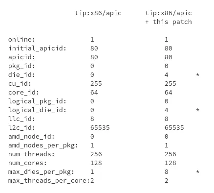

# 今日开源新闻汇总2024-4-2
## 1.
Linux 6.10内核周期之前，TIP.git的"x86/cpu"分支中排队的一个补丁增加了对AMD 0x80000026叶片的支持，以纠正一些新型AMD处理器的CPU拓扑信息报告。
 
该补丁允许Linux内核利用扩展的CPUID叶片0x80000026来获取拓扑信息，这些信息在CPUID叶片0xb中无法获得或正确解析。特别是，0x80000026叶片包含了一些新型处理器上正确的CCX和CCD芯片信息。这将确保Linux正确报告正确的芯片ID、逻辑芯片ID、每个封装的最大芯片数、CPU芯片和CPU芯片列表。
 

 
该补丁没有详细说明哪些特定的AMD CPU需要0x80000026叶片来获得正确的拓扑信息，但它确实指出，一款第四代EPYC 128核/256线程处理器需要它来进行正确的报告。这很可能是AMD EPYC 9754 “Bergamo"处理器。新代码演示的报告差异如图：
 

 
关于这个AMD 0x80000026叶片解析的更多细节可以通过这个补丁获得。再次说明，由于现在已经在TIP.git中，并通过x86/cpu方式，这个修正的AMD CPU拓扑信息应该提交给下一个内核周期，即Linux 6.10，而不是进入当前v6.9周期的"x86/fixes”。
 
## 2.
