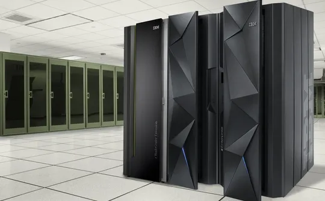
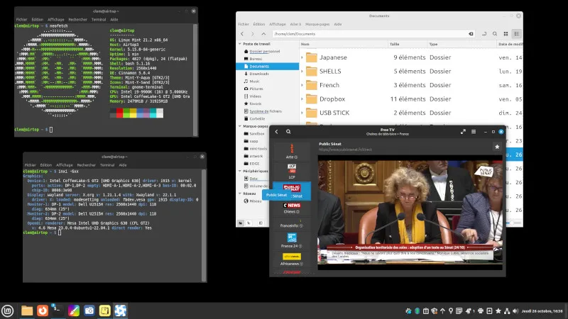
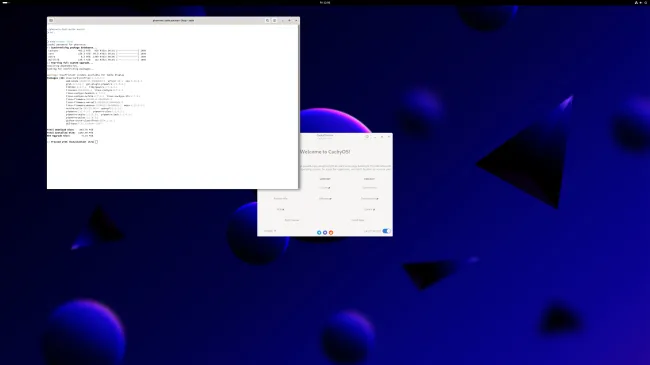
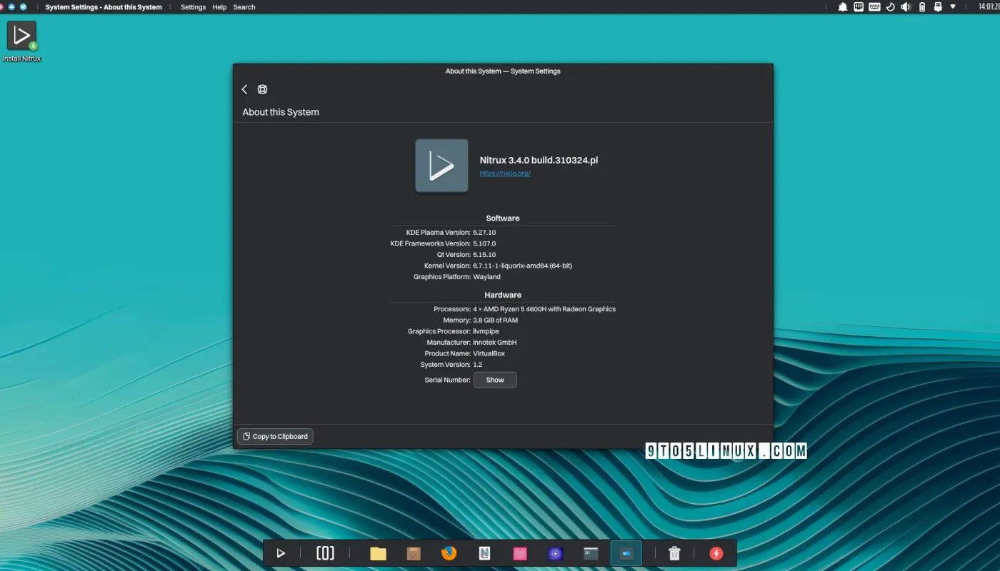

# 今日开源新闻汇总2024-4-2
## 1.
Linux 6.10内核周期之前，TIP.git的"x86/cpu"分支中排队的一个补丁增加了对AMD 0x80000026叶片的支持，以纠正一些新型AMD处理器的CPU拓扑信息报告。
 
该补丁允许Linux内核利用扩展的CPUID叶片0x80000026来获取拓扑信息，这些信息在CPUID叶片0xb中无法获得或正确解析。特别是，0x80000026叶片包含了一些新型处理器上正确的CCX和CCD芯片信息。这将确保Linux正确报告正确的芯片ID、逻辑芯片ID、每个封装的最大芯片数、CPU芯片和CPU芯片列表。
 

 
该补丁没有详细说明哪些特定的AMD CPU需要0x80000026叶片来获得正确的拓扑信息，但它确实指出，一款第四代EPYC 128核/256线程处理器需要它来进行正确的报告。这很可能是AMD EPYC 9754 “Bergamo"处理器。新代码演示的报告差异如图：
 

 
关于这个AMD 0x80000026叶片解析的更多细节可以通过这个补丁获得。再次说明，由于现在已经在TIP.git中，并通过x86/cpu方式，这个修正的AMD CPU拓扑信息应该提交给下一个内核周期，即Linux 6.10，而不是进入当前v6.9周期的"x86/fixes”。
 
## 2.
Linux 6.9的特性之一是，s390内核构建现在可以使用完整的LLVM编译器堆栈进行。
 
IBM s390/zSeries硬件的Linux内核代码现在可以除了长期使用的GNU编译器集合（GCC）之外，还可以用LLVM/Clang构建。在v6.9合并窗口期间，s390合并回来的更改允许使用“LLVM=1”选项编译s390内核。不过，这确实需要最新的LLVM编译器代码，因为只有全新的LLVM/Clang 18.1编译器版本才能看到适当的s390/SystemZ支持。
 
使用LLVM=1构建Linux内核，不仅可以使用Clang编译器，还可以使用ld.lld链接器和其他各种LLVM工具（CC=clang LD=ld.lld AR=llvm-ar NM=llvm-nm STRIP=llvm-strip OBJCOPY=llvm-objcopy OBJDUMP=llvm-objdump READELF=llvm-readelf HOSTCC=clang HOSTCXX=clang++ HOSTAR=llvm-ar HOSTLD=ld.lld）。以前，IBM s390/SystemZ Linux内核可以用Clang构建，但保留了其他GNU工具。
 
周日合并到Linux 6.9的文档更新概述了使用LLVM 18.1+时完整的“LLVM=1”内核构建支持。
 

 
## 3.
Serpent OS Linux发行项目希望在未来几周内能够发布他们的预Alpha ISO，因为他们继续推进初始桌面体验，并使他们的操作系统构建工具更加完善。
 
Doherty在2024年3月的状态更新中概述了这个原创Linux发行版的最新工作。这位前Solus Linux创始人总结了Serpent OS的最新努力：
 
1.Serpent OS一直在努力提升他们的桌面体验，包括打包NetworkManager、Vulkan和Mesa驱动支持，以及其他核心桌面部件。GNOME软件和Flatpak也作为这个初始的"裸机启动硬件"努力的一部分在工作。
 
2.Serpent OS正在跟踪System76所做的工作，他们用Rust编写了COSMIC桌面，并期待在Serpent OS中提供它。
 
3.Serpent OS希望很快能够发布这个Linux发行版的预Alpha ISO。
 
4.Serpent OS的Boulder构建工具已经进行了工作，以提高性能，在某些情况下，打包时间比以前快了大约50%。
 
5.Boulder的包负载现在使用多线程Zstd压缩。
 
6.Serpent的Moss工具也进行了优化、代码清理和其他工作。
 
Serpent OS开发者希望能够在"未来几周"发布预Alpha ISO，并预计在4月底前有更多消息。更多信息请访问SerpentOS.com。
 

 
## 4.
Linux Mint 团队在他们三月份的状态更新中分享了更多关于即将发布的基于 Ubuntu 24.04 LTS 的 Linux Mint 22 的细节。
 
在 Linux Mint 22 发布道路上的最新更新包括对本地化支持的更多工作，软件源工具将支持 Deb822 格式，PipeWire 将作为 Linux Mint 22 的默认声音服务器，Pix 图像查看器将支持 JPEG-XL 图像，并且他们打算继续使用 Ubuntu 的内核版本。Linux Mint 还致力于为 GIMP 文件开发了一个新的缩略图制作器，Linux Mint 将打包他们自己的 Thunderbird 邮件客户端，而不是跟随 Ubuntu 使用 Thunderbird Snap，并且 GNOME Online Accounts 已被分叉为一个新的 Linux Mint XApp。Linux Mint 也在继续开发 Jargonaut 聊天室应用。
 
很高兴看到 Linux Mint 支持 JPEG-XL，考虑到 Ubuntu 24.04 不会默认支持 JPEG-XL，而是需要从 universe 存档中安装一个包来支持。与此同时，使用 PipeWire 而不是 PulseAudio 作为默认的音频服务器几乎不再是什么新鲜事，因为几乎所有的桌面 Linux 发行版都已经迁移到了 PipeWire，用于 Linux 桌面的音频/视频流。
 
有关 Linux Mint 最新开发活动的更多细节，请查看今天的 Linux Mint 博客文章。
 

 
## 5.
CachyOS是一个基于Arch Linux的发行版，专注于提供高性能的开箱即用体验，并支持x86-64-v3和x86-64-v4包，以及与上游Arch Linux相比的其他默认更改。CachyOS的2024年4月ISO版本现已发布，供那些想要享受这个滚动发布、性能调优平台的新鲜体验的用户使用。
 
作为一个基于Arch Linux的滚动发布版本，CachyOS已经开始发布包含恶意代码的最新XZ版本。这对XZ来说是一个严重的灾难，目前仍在由许多不同方面进一步调查中。CachyOS已经为他们的XZ包添加了一个补丁，以确保一切正常。
 
CachyOS的2024年4月版本现在默认使用Plymouth启动画面，提供一个漂亮的默认主题启动动画，以提供一个令人愉悦的启动体验。
 
由于Calamares安装程序在切换键盘布局时出现问题，CachyOS不得不仅对他们的ISO默认使用X11。
 
CachyOS更新还包括一个新的分区布局，有独立的/boot和/boot/efi分区，特别是在与Microsoft Windows或其他Linux发行版进行双启动安装时，可以更好地处理rEFInd。
 
CachyOS.org博客概述的2024年4月更新还包括各种bug修复和其他包更新。
 

 
## 6.

 
Nitrux开发者Uri Herrera今天宣布，Nitrux 3.4作为这个基于Debian的、无systemd的、不可变的发行版的最新稳定版本已经发布，并且可供普遍使用。这个发行版围绕KDE软件构建。
 
Nitrux的月度发布持续进行，Nitrux 3.4作为另一个版本发布，搭载了KDE Plasma 5.27.10 LTS桌面环境系列，这将继续是Nitrux在2024年的默认图形环境，直到开发者们将其切换到Maui Shell。
 
这意味着Nitrux不会升级到最新的KDE Plasma 6桌面环境。此外，从这个版本开始，Nitrux现在使用来自Debian的KDE Plasma、KDE Gear和KDE Frameworks包，而不是KDE neon，后者已经转移到KDE的最新Plasma、Frameworks和Qt发布版本。
 
Uri Herrera在博客文章中说：
 
*“这意味着，是的，在2024年末，我们将默认开始使用Maui Shell作为我们的主要（也是唯一的）桌面环境，告别十年使用KDE Plasma的时光。然而，这并不意味着我们不会继续使用KDE技术；我们会继续使用。”*
 
为什么Nitrux不使用KDE Plasma 6？因为它的定制Plasma桌面，NX Desktop，使用了太多尚未移植到Plasma 6的小部件和plasmoids。这将给Nitrux开发者更多时间专注于他们的Maui Shell和Maui Apps，这些应用也正在被移植到最新的Qt 6应用程序框架。
 
Nitrux 3.4版本还包括Linux内核6.7.11，Mozilla Firefox 124网络浏览器，一个更新的Nitrux更新工具系统实用程序，现在它会在检测到NVIDIA硬件时显示警告，以及一个更新的NX桌面配置实用程序，现在可以让你打开/关闭双击以在Maui Apps中打开文件夹。
 
此外，新的Nitrux版本还包括一个为Plasma系统监视器应用程序更新的自定义页面插件，用于显示CPU温度和频率，以及四个新包，即saferm包装器，用于拦截执行rm命令，GeoClue D-Bus地理信息服务，Powercap工具，用于访问powercap Linux内核功能，以及Ethtool实用程序，用于控制网络驱动程序和硬件。
 
当然，各种bug被修复，驱动程序也得到更新，以获得更好的硬件支持。Nitrux 3.4现在可以从官方网站下载新安装。
 
## 7.
今天为Linux 6.9内核提交了新一轮的Bcachefs文件系统修复。这一轮包括许多修复措施，用于处理这个实验性开源文件系统上的“极端文件系统损坏”。
 
Bcachefs的主要开发者Kent Overstreet描述了今天的拉取请求： 
 
*“对极端文件系统损坏情况的大量修复。其中一个修复（‘修复btree写缓冲区中的日志固定’）适用于正常使用；还有一个直接I/O性能修复。*
 
*新的修复/构建代码处于最后阶段，预计将在一周内准备就绪。任何因分裂脑错误而丢失了btree内部节点（或其他各种损坏）的人，届时将能够进行修复。”*
 
这是一大批修复，由Overstreet提交了29个补丁，然后是其他三个开发者的另外三个补丁。这个拉取请求由不同的修复组成，除非有异议，否则应很快合并到Linux Git中，预计在下周日发布的Linux 6.9-rc3之前。随着Bcachefs的发展步伐，我们可能会在6.9或6.10内核上进行新一轮的Linux文件系统基准测试。
 
## 8.
