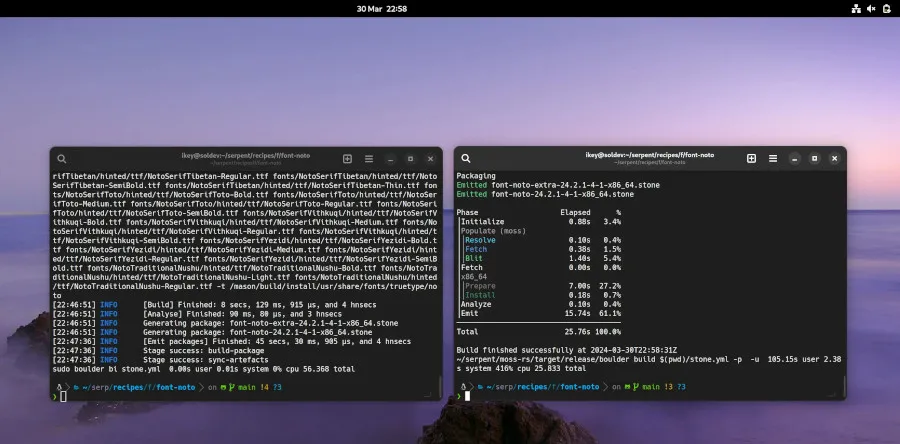

# 今日开源新闻汇总2024-4-2
## 1.
Linux 6.10内核周期之前，TIP.git的"x86/cpu"分支中排队的一个补丁增加了对AMD 0x80000026叶片的支持，以纠正一些新型AMD处理器的CPU拓扑信息报告。
 
该补丁允许Linux内核利用扩展的CPUID叶片0x80000026来获取拓扑信息，这些信息在CPUID叶片0xb中无法获得或正确解析。特别是，0x80000026叶片包含了一些新型处理器上正确的CCX和CCD芯片信息。这将确保Linux正确报告正确的芯片ID、逻辑芯片ID、每个封装的最大芯片数、CPU芯片和CPU芯片列表。
 

 
该补丁没有详细说明哪些特定的AMD CPU需要0x80000026叶片来获得正确的拓扑信息，但它确实指出，一款第四代EPYC 128核/256线程处理器需要它来进行正确的报告。这很可能是AMD EPYC 9754 “Bergamo"处理器。新代码演示的报告差异如图：
 

 
关于这个AMD 0x80000026叶片解析的更多细节可以通过这个补丁获得。再次说明，由于现在已经在TIP.git中，并通过x86/cpu方式，这个修正的AMD CPU拓扑信息应该提交给下一个内核周期，即Linux 6.10，而不是进入当前v6.9周期的"x86/fixes”。
 
## 2.
Linux 6.9的特性之一是，s390内核构建现在可以使用完整的LLVM编译器堆栈进行。
 
IBM s390/zSeries硬件的Linux内核代码现在可以除了长期使用的GNU编译器集合（GCC）之外，还可以用LLVM/Clang构建。在v6.9合并窗口期间，s390合并回来的更改允许使用“LLVM=1”选项编译s390内核。不过，这确实需要最新的LLVM编译器代码，因为只有全新的LLVM/Clang 18.1编译器版本才能看到适当的s390/SystemZ支持。
 
使用LLVM=1构建Linux内核，不仅可以使用Clang编译器，还可以使用ld.lld链接器和其他各种LLVM工具（CC=clang LD=ld.lld AR=llvm-ar NM=llvm-nm STRIP=llvm-strip OBJCOPY=llvm-objcopy OBJDUMP=llvm-objdump READELF=llvm-readelf HOSTCC=clang HOSTCXX=clang++ HOSTAR=llvm-ar HOSTLD=ld.lld）。以前，IBM s390/SystemZ Linux内核可以用Clang构建，但保留了其他GNU工具。
 
周日合并到Linux 6.9的文档更新概述了使用LLVM 18.1+时完整的“LLVM=1”内核构建支持。
 

 
## 3.
Serpent OS Linux发行项目希望在未来几周内能够发布他们的预Alpha ISO，因为他们继续推进初始桌面体验，并使他们的操作系统构建工具更加完善。
 
Doherty在2024年3月的状态更新中概述了这个原创Linux发行版的最新工作。这位前Solus Linux创始人总结了Serpent OS的最新努力：
 
1.Serpent OS一直在努力提升他们的桌面体验，包括打包NetworkManager、Vulkan和Mesa驱动支持，以及其他核心桌面部件。GNOME软件和Flatpak也作为这个初始的"裸机启动硬件"努力的一部分在工作。
 
2.Serpent OS正在跟踪System76所做的工作，他们用Rust编写了COSMIC桌面，并期待在Serpent OS中提供它。
 
3.Serpent OS希望很快能够发布这个Linux发行版的预Alpha ISO。
 
4.Serpent OS的Boulder构建工具已经进行了工作，以提高性能，在某些情况下，打包时间比以前快了大约50%。
 
5.Boulder的包负载现在使用多线程Zstd压缩。
 
6.Serpent的Moss工具也进行了优化、代码清理和其他工作。
 
Serpent OS开发者希望能够在"未来几周"发布预Alpha ISO，并预计在4月底前有更多消息。更多信息请访问SerpentOS.com。
 

 
## 4.
