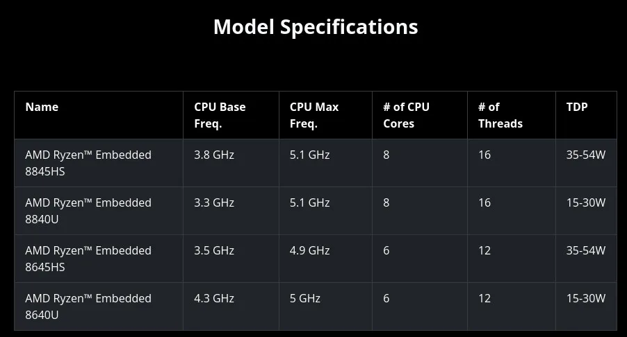
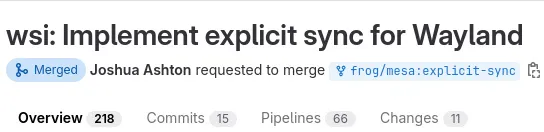
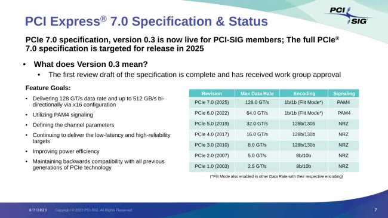

# 今日开源新闻汇总2024-4-3
## 1.
Qt 6.7作为这个跨平台、商业焦点工具包的最新功能更新已经发布。
 
Qt 6.7为这个广泛使用的工具包带来了许多新功能，包括：
 
--对C++20的支持准备。
 
--Qt Graphs模块在3D图形方面进行了许多改进，并提供了创建2D图形的技术预览支持。
 
--Qt GUI模块的QFont新增了与可变字体（Variable Fonts）工作的API。
 
--QNetworkRequestFactory以技术预览的形式出现，作为创建网络请求的便利类。Qt Network中还有QRestAccessManager和QRestReply作为RESTful用例的新技术预览类。
 
--众多Qt Quick新增功能。
 
--Qt SVG模块增加了对SVG 1.1标准某些元素的支持。
 
--Qt 6.7在Windows上增加了Windows 11风格。
 
--Qt 6.7在Wayland上现在有了QNativeInterface::QWaylandScreen来访问QScreen的底层Wayland对象。
 
--Qt在WebAssembly上支持拖放。OpenGL ES 3和WebGL2现在也是Qt在WebAssembly上的默认选项。
 

 
## 2.
Simple DirectMedia Layer（SDL）是一个常用于游戏和其他跨平台软件的软硬件抽象层，最新的稳定版本SDL 2.30.2已经发布，同时还有一个新的SDL3预览版本。
 
SDL 2.30.2版本：
 
--修复了Linux上控制器初始化的性能退化问题
 
--增加了对Nintendo Online的6键SEGA Mega Drive控制器的支持
 
--增加了对MadCatz Saitek侧面控制面板的支持
 
--增加了对Hori Fighting Stick EX2的支持
 
--增加了对Yawman Arrow飞行摇杆的支持
 
--为Defender Joystick Cobra R4增加了游戏手柄映射
 
--修复了Sanwa Supply JY-P76USV控制器的游戏手柄映射
 
--使用DirectInput时轮询初始控制器状态
 
--允许使用SDL_RWFromFile()与命名管道
 
通过GitHub可以下载并获取更多关于SDL 2.30.2的详情。
 
最近发布了SDL 3.0的预览版本，现在又有了第二个预览版本，以帮助审查重大的SDL3更新。新的SDL3预览版：
 
--修复了使用Vulkan渲染器渲染大量内容时的崩溃问题
 
--修复了在未调用SDL_StartTextInput()时文本输入被传递的问题
 
--在Windows上增加了对原始键盘事件的支持
 
--修复了Linux上控制器初始化的性能退化问题
 
--将操纵杆电源状态分为电池状态和百分比
 
--在主回调入口点增加了一个可选的用户参数
 
--不区分大小写的字符串比较函数不再受到地区设置的影响
 
通过GitHub可以获取这些详情和下载信息。
 

 
## 3.
AMD今天宣布了Ryzen Embedded 8000系列处理器——这是他们首款提供带有板载神经处理单元（NPU）的Ryzen AI的AMD嵌入式芯片。这种AMD XDNA NPU支持与现有的Ryzen 8000系列上的Ryzen AI类似。
 
Ryzen Embedded 8000系列使用Zen 4核心，并将提供最多8核心/16线程的设计。Ryzen Embedded 8000系列使用与Ryzen 8000G系列相同的4nm TSMC工艺。Ryzen Embedded 8000系列部件的TDP将在15至54瓦特之间。
 

 
Ryzen Embedded 8000系列的顶级产品是Ryzen Embedded 8845HS，基础频率为3.8GHz，最大频率为5.1GHz，拥有8核心/16线程，cTDP为35~54瓦特。在产品线中较低位置的是6核心的Ryzen Embedded 8640U和Ryzen Embedded 8645HS部件。
 
随着Ryzen Embedded 8000系列支持Ryzen AI NPU，AMD正在为这些新处理器大力宣传工业AI能力。早在1月底，AMD终于发布了Ryzen AI / XDNA的开源Linux驱动程序。这对于Linux在Ryzen嵌入式设备上更为常见的情况来说是个好消息，因此这个驱动程序在未来的嵌入式/工业应用中将变得更加重要。不过，我还没有听说AMD有关于他们的XDNA驱动在Linux内核中的上游计划，或者其他围绕他们的XDNA / Ryzen AI软件工作的Linux计划。
 
鉴于这些都是在Zen 4上的迭代，并且那里已经有了稳定的支持，Ryzen Embedded 8000系列的Linux支持总体上应该是很好的，除了新的XDNA驱动程序对Ryzen AI及其在目前有限的软件支持可能存在的任何特殊性或问题。
 
AMD今天发布了一篇简短的博客文章，宣布了Ryzen Embedded 8000系列。还有一个Ryzen Embedded 8000系列产品页面，上面有关于这些新产品的更多细节。AMD的合作伙伴很快将推出Ryzen Embedded 8000系列系统。
 
## 4.
Mesa 24.1的Vulkan窗口系统集成（WSI）代码现在支持Wayland linux-drm-syncobj-v1协议，以实现显式同步支持。
 
3月底发布的Wayland Protocols 1.34引入了新的linux-drm-syncobj协议，允许使用DRM同步对象在Wayland下进行显式同步。这一直是提高Vulkan/OpenGL游戏等的同步支持的热切需求。GNOME合成器上周合并了实现此协议的支持，现在Mesa 24.1已经通过WSI集成为Vulkan驱动程序提供了支持。这个协议对于NVIDIA的专有Linux图形驱动程序来说也是一个大事，因为它解决了一些剩余的Wayland问题。Valve的Gamescope合成器已经合并了显式同步支持，除了GNOME Mutter代码之外，KDE Kwin和wlroots的合并请求仍然开放。XWayland对显式GPU同步的支持也接近尾声。
 
Valve的Joshua Ashton提出了Mesa的wsi：实现Wayland显式同步的合并请求，引入了这一支持。截至今天早上，它已经在Mesa Git中。Mesa 24.1预计将在5月底作为稳定版发布。
 

 
## 5.
PCI-SIG 今天宣布，他们已经发布了即将到来的 PCI Express 7.0 规范的最新修订版“版本 0.5”。
 
PCIe 7.0 规范预计将在 2025 年完成，而现在版本 0.5 已经向 PCI-SIG 成员发布。PCIe 7.0 正在努力实现 PCIe x16 配置中的 512 GB/s 双向带宽，并使用 PAM4 信号。
 
今天的 PCIe 7.0 版本 0.5 规范接替了去年夏天的初步（版本 0.3）规范发布。PCI-SIG 公布的 PCI Express 7.0 亮点包括：
 
--通过 x16 配置提供 128 GT/s 原始比特率和高达 512 GB/s 的双向带宽
 
--利用 PAM4（4 级脉冲幅度调制）信号
 
--关注通道参数和覆盖范围
 
--继续提供低延迟和高可靠性目标
 
--提高能效
 
--与 PCIe 技术的所有前代版本保持向后兼容
 
PCIe 7.0 的巨大带宽对未来的 AI 加速器、800G+ 以太网以及不断增长的 HPC 和超大规模计算需求至关重要。
 
更多关于 PCIe 7.0 v0.5 规范的详情，请访问 PCISIG.com。
 

 
