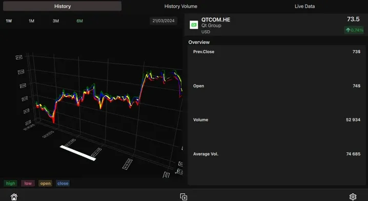

# 今日开源新闻汇总2024-4-3
## 1.
Qt 6.7作为这个跨平台、商业焦点工具包的最新功能更新已经发布。
 
Qt 6.7为这个广泛使用的工具包带来了许多新功能，包括：
 
--对C++20的支持准备。
 
--Qt Graphs模块在3D图形方面进行了许多改进，并提供了创建2D图形的技术预览支持。
 
--Qt GUI模块的QFont新增了与可变字体（Variable Fonts）工作的API。
 
--QNetworkRequestFactory以技术预览的形式出现，作为创建网络请求的便利类。Qt Network中还有QRestAccessManager和QRestReply作为RESTful用例的新技术预览类。
 
--众多Qt Quick新增功能。
 
--Qt SVG模块增加了对SVG 1.1标准某些元素的支持。
 
--Qt 6.7在Windows上增加了Windows 11风格。
 
--Qt 6.7在Wayland上现在有了QNativeInterface::QWaylandScreen来访问QScreen的底层Wayland对象。
 
--Qt在WebAssembly上支持拖放。OpenGL ES 3和WebGL2现在也是Qt在WebAssembly上的默认选项。
 

 
## 2.
Simple DirectMedia Layer（SDL）是一个常用于游戏和其他跨平台软件的软硬件抽象层，最新的稳定版本SDL 2.30.2已经发布，同时还有一个新的SDL3预览版本。
 
SDL 2.30.2版本：
 
--修复了Linux上控制器初始化的性能退化问题
 
--增加了对Nintendo Online的6键SEGA Mega Drive控制器的支持
 
--增加了对MadCatz Saitek侧面控制面板的支持
 
--增加了对Hori Fighting Stick EX2的支持
 
--增加了对Yawman Arrow飞行摇杆的支持
 
--为Defender Joystick Cobra R4增加了游戏手柄映射
 
--修复了Sanwa Supply JY-P76USV控制器的游戏手柄映射
 
--使用DirectInput时轮询初始控制器状态
 
--允许使用SDL_RWFromFile()与命名管道
 
通过GitHub可以下载并获取更多关于SDL 2.30.2的详情。
 
最近发布了SDL 3.0的预览版本，现在又有了第二个预览版本，以帮助审查重大的SDL3更新。新的SDL3预览版：
 
--修复了使用Vulkan渲染器渲染大量内容时的崩溃问题
 
--修复了在未调用SDL_StartTextInput()时文本输入被传递的问题
 
--在Windows上增加了对原始键盘事件的支持
 
--修复了Linux上控制器初始化的性能退化问题
 
--将操纵杆电源状态分为电池状态和百分比
 
--在主回调入口点增加了一个可选的用户参数
 
--不区分大小写的字符串比较函数不再受到地区设置的影响
 
通过GitHub可以获取这些详情和下载信息。
 

 
## 3.
