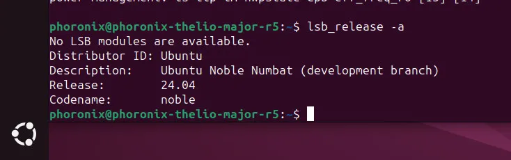
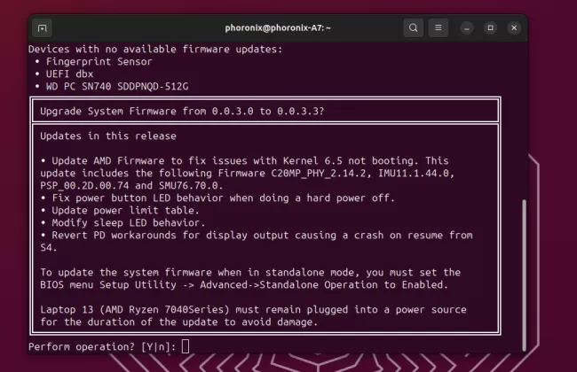
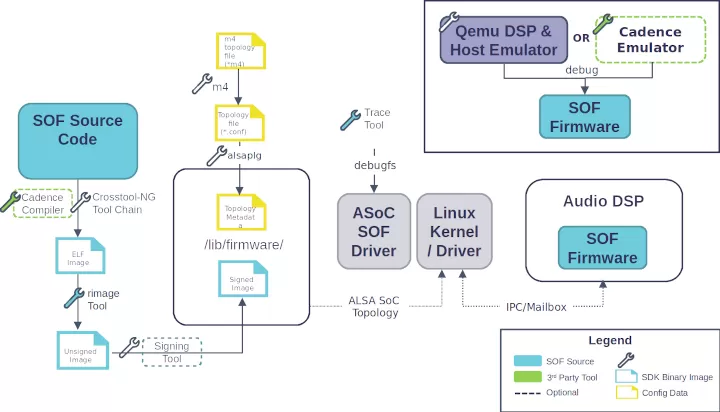
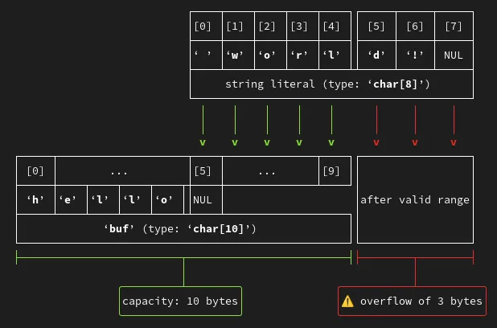
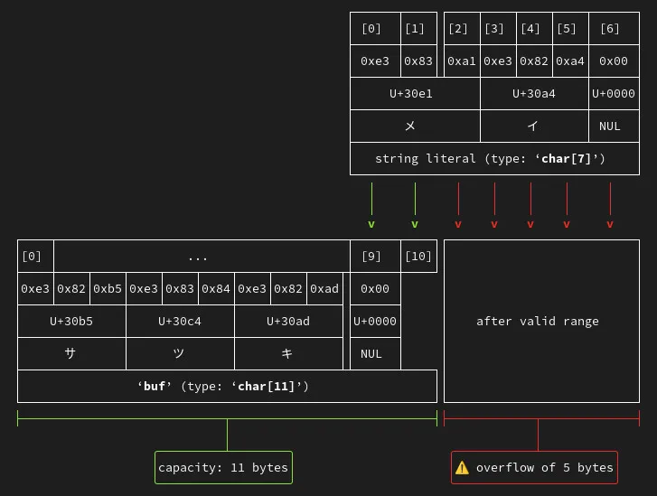

# 今日开源新闻汇总 2024-4-4
## 1.
Ubuntu 24.04 beta 版本原定于明天发布，但由于 XZ 安全问题，出于谨慎考虑，决定推迟一周以重建软件包。
 
Canonical 决定在为 xz-utils 软件包构建了受损的 XZ 代码后，重建 Ubuntu 24.04（Noble Numbat）的所有二进制包。虽然没有迹象表明其他软件包也受到影响，但出于谨慎，他们在编译恶意 XZ 包后，决定重建所有构建中的二进制文件。
 

 
由于重建软件包需要时间，Ubuntu 24.04 beta 版本的发布日期已从 4 月 4 日推迟到 4 月 11 日。
 
Ubuntu 24.04 Beta 延迟通知今天已发布到 Ubuntu Discourse。
 
官方的 Ubuntu 24.04 LTS 版本发布日期仍然预定于 4 月 25 日。
 
## 2.
由于 XZ 安全问题和恶意代码的远程代码执行风险，更多开源项目出于谨慎正在重新评估对 XZ 的依赖。最新采取行动的是 Fwupd Linux 固件更新工具和 LVFS，现在将优先选择 Zstd 压缩而不是 XZ。
 
Fwupd 依赖 XZ 压缩其大型 XML 负载，以加快网络下载速度并节省 CDN 资源。XZ 提供了比之前使用的 Gzip 更好的压缩效果。但鉴于对 XZ 项目的担忧，Richard Hughes 现在改用 Zstd。
 

 
Zstd 不仅更值得信赖，而且压缩后的元数据比 XZ 小约 3%，解压数据的速度也更快。
 
这一变更将应用于下周发布的 Fwupd 版本。有关 Fwupd 从 XZ 切换到 Zstd 的更多详情，请参阅[此博客文章](https://blogs.gnome.org/hughsie/2024/04/03/fwupd-and-xz-metadata/)。
 
## 3.
Sound Open Firmware 2.9 版本已发布，这个开源项目提供音频 DSP 固件基础设施和相应的 SDK。这项最初由 Intel 启动的工作，旨在开放更多的音频硬件固件，现已发展成为一个多供应商项目，AMD 和 Mediatek 等公司也围绕这个声音固件基础设施、音频驱动等参与其中。
 
在 Sound Open Firmware 2.9 中，Aria、Mixin/Mixout 和 DRC 的音频模块进行了“重大”性能优化。发布说明并未详细说明这些重大性能优化的具体内容。
 

 
Sound Open Firmware 2.9 还增强了其可加载模块支持，更多组件已迁移到 SOF 模块 API，并且修复了许多错误。
 
Sound Open Firmware 2.9 版本还为 Intel 和 NXP 硬件带来了新的拓扑结构。在 Intel 方面，最近有很多工作是关于 SOF 对 Lunar Lake (LNL) 平台支持的完善。
 
有关 Sound Open Firmware 2.9 版本的下载和更多详情，请通过 GitHub 查看。
 
## 4.
Valve的开源Linux图形驱动团队的Samuel Pitoiset已经在RADV Vulkan驱动中为Vulkan VK_EXT_device_address_binding_report扩展提供了支持，该扩展将包含在Mesa 24.1中。
 
VK_EXT_device_address_binding_report扩展最初在Vulkan 1.3.230中添加，它允许应用程序跟踪GPU虚拟地址空间的区域绑定，以便将这些区域与特定的Vulkan对象关联起来。能够将GPU出错的地址追溯到一个Vulkan对象，这在调试中非常有帮助。
 

 
Pitoiset在为Mesa RADV驱动配置VK_EXT_device_address_binding_report支持时，简单地总结道： 
 
*“对于调试GPU挂起非常有用。”*
 
这次合并今天已经进入Mesa Git，为本季度的Mesa 24.1稳定版本发布前的GPU调试提供帮助。RADV是第一个支持此VK_EXT_device_address_binding_report扩展的Mesa Vulkan驱动。
 
## 5.
David Malcolm的Red Hat编译器团队发布了他的年度博客文章，总结了即将发布的GCC 14稳定编译器版本中的静态分析改进。
 
Malcolm继续在GNU编译器集合的静态分析器支持（-fanalyzer）方面进行工作，并在这一领域取得了更多的增强。例如，GCC 14增加了一个新的“-Wanalyzer-infinite-loop”选项，尝试检测发生的简单无限循环案例。
 
在GCC 13的越界警告基础上，GCC 14编译器带来了缓冲区溢出的改进可视化。Malcolm设计了一些不错的基于文本的图表，更好地显示缓冲区溢出警告，以便开发者更容易理解问题。以下是David Malcolm分享的两个改进的ASCII艺术示例，用于可视化缓冲区溢出：
 

 

 
GCC 14分析器还改进了对C字符串操作的分析支持，现在通过-fanalyzer启用了新的基于污点的警告等。
 
稳定的GCC 14.1编译器版本预计在未来几周内发布。更多关于GCC 14静态分析器改进的详情，请访问Red Hat开发者博客。
 
## 6.
去年，X.Org Server默认禁用了字节交换客户端，因为它是X.Org/XWayland代码库中一个大而已知的攻击面。今天公开的四个新CVE中有三个就是关于字节交换代码的，这进一步证明了这一点。
 
字节交换客户端支持是围绕不同CPU字节序的X.Org/XWayland客户端能够连接到X.Org Server。如今，不同的CPU字节序并不常见，去年字节交换客户端支持在没有太多争议的情况下被安全禁用。今天公开的三个CVE涉及ProcXIGetSelectedEvents、ProcXIPassiveGrabDevice、ProcAppleDRICreatePixmap中的堆缓冲区过度读取/数据泄露以及由于字节交换处理而造成的问题。
 

 
今天提出的第四个问题是ProcRenderAddGlyphs中的使用后自由问题。
 
XWayland 23.2.5和X.Org Server 21.1.12今天发布，用于修复这四个最新的安全问题。详情请参阅今天的安全通告。
 
## 7.
