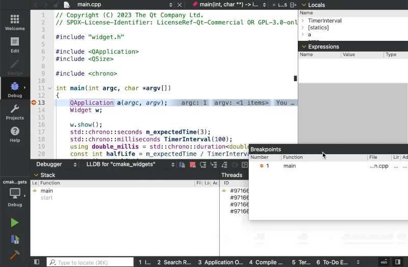
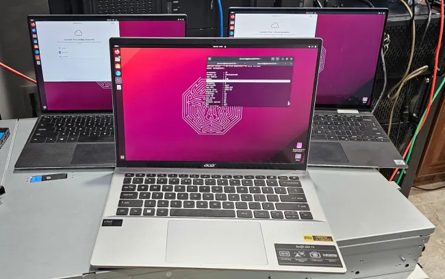

# 今日开源新闻汇总 2024-4-5
## 1.
在提交了一个针对 Bcachefs 的 Linux 6.9 拉取请求（pull request）以更好地应对“极端文件系统损坏”两天后，又提交了另一个拉取请求，旨在提高这个较新的写时复制（copy-on-write）开源文件系统的恢复能力。
 
尽管新增了一千多行代码，这个最新的拉取请求旨在大幅提高 Bcachefs 的修复能力。它仍然在 Linux 6.9 内核周期的“修复”阶段被发送，至少现在在帮助从文件系统的意外中恢复方面应该更加健壮。Bcachefs 的主要开发者 Kent Overstreet 指出，有了这些最新的补丁，文件系统的修复代码“应该是完整的”，如果不是，他希望立即听到任何问题。
 

 
Overstreet 在拉取请求中解释了 Bcachefs 修复代码的良好状态：
 
*“又有几处小修复，以及新的修复代码。*
 
*我们现在可以通过扫描自动恢复任意损坏的内部 btree 节点，并且可以根据需要重建元数据，将文件系统恢复到一个工作中、一致的、可读写的状态，并保留对未损坏内容的访问。*
 
*这意味着 - 你可以除了 extents 和 dirents 叶节点之外，清除所有元数据，修复将重建其他一切并给你数据，并且在正确的路径下。如果 inode 缺失，i_size 将会略有偏差，权限/所有权/时间戳将会丢失，如果使用了快照，我们仍然需要快照 btree - 将来我们将能够在某些情况下猜测快照树结构。*
 
*换句话说 - 除了摆脱剩余的错误（模糊测试还在进行中），修复代码应该是完整的，如果修复工作无法完成，那将是我想要立即知道的最高优先级的错误。*
 
*这个补丁集是由一位来自印度的用户友好地测试的，他不小心擦除了家用电脑上一个没有复制的三驱动器文件系统中的一个驱动器 - 虽然花了几周时间，但我们找回了所有重要的数据。”*
 
这些代码现在等待 Linus Torvalds 拉取，以进一步提高 Bcachefs 在主线内核上的质量。
 
## 2.
最近在 Linux 6.10 合并窗口之前，加密子系统的开发分支中加入了对 VFIO 实时迁移的支持，这一支持是针对英特尔的 QuickAssist Technology (QAT) 驱动程序的。
 
英特尔 QAT 对于加速支持软件的压缩和加密非常有用，特别是在拥有 QAT 加速卡或在最近的 Xeon 可扩展处理器上找到 QAT 支持的情况下。这种实时迁移支持是关于能够处理在节点之间迁移的客户虚拟机，同时保留 QAT 支持。
 

 
新排队的代码允许 Intel QAT Gen4 SRIOV 虚拟功能 (VFs) 的实时迁移。QAT 驱动程序可以保存和恢复 VF 所包含的bank 的状态。英特尔补丁系列解释说： 
 
*以下是测试 QAT GEN4 VF 实时迁移所需的步骤：*
 
*1.将一个或多个 QAT GEN4 VF 设备绑定到模块 qat_vfio_pci.ko*
 
*2.将 VFs 分配给虚拟机并启用设备实时迁移*
 
*3.在 VM 内部使用 QAT VF 运行工作负载，例如使用 qatlib*
 
*4.将 VM 从源节点迁移到目的节点*
 
为 Intel QAT 准备的实时迁移支持的补丁已在 cryptodev-2.6.git 中排队，以便在下个月开放的 Linux 6.10 合并窗口之前准备好。
 
## 3.
LLVM的BOLT是一个优化二进制文件布局的强大工具，从而可以带来一些非常有用的性能改进。但现在，一位Arm编译器工程师利用BOLT创建了一个二进制分析工具，以审查安全加固选项的正确性。
 
Arm编译器工程师Kristof Beyls提出了一个基于BOLT的解决方案的初始概念证明，以评估二进制文件的安全加固。 
 
*“我们缺乏验证安全加固特性正确代码生成的好工具。大多数安全加固特性只通过少量回归测试进行测试。仅仅运行大量编译了安全加固特性的代码并不能很好地测试它们：它检查程序是否仍然为给定输入产生预期输出，但它不检查是否使恶意利用二进制文件变得更难。*
 
*这个RFC提议构建一个静态二进制分析器，可以扫描二进制文件以验证给定的加固特性是否已在整个二进制文件中正确应用。我已经在BOLT之上构建了一个原型，并提议改进它，使其足以能够上游传输。”*
 
在LLVM论坛上的一个RFC帖子中，Kristof Beyls概述了他利用BOLT进行这种安全加固分析的初始工作——这远远超出了Facebook/Meta开发BOLT时的原始性能意图。
 
该工具旨在验证诸如堆栈保护器、堆栈冲突保护、分支保护、控制流保护等特性。二进制分析工具将验证整个程序的加固特性，并且比今天使用的有限的安全加固测试更加详细。
 
初始代码称为“llvm-bolt-gadget-scanner”，目前处于原型形式。到目前为止的结果是有希望的，并且希望能够构建一个有用的二进制扫描器。在其他上游LLVM开发人员的支持下，有希望能够将这样的工具上游传输到代码库中。
 
除了上述的RFC消息外，这个小工具扫描器的原型代码可以在GitHub上找到。
 
## 4.
Qt 6.7 工具包在本周早些时候发布后，今天发布了 Qt Creator 13 集成开发环境。Qt Creator 是为 Qt/C++ 定制的 IDE，旨在通过紧密的 Qt 集成和支持多种功能来加速开发人员的生产力。
 
Qt Creator 13 为 Linux on ARM 提供了离线和在线安装程序，改进了作为 Qt Creator 13 一部分的停靠用户界面，增强了 IDE 的欢迎模式，对 Apple iOS 17 设备提供了部分支持，并且对 Qt 应用程序管理器提供了初步支持。Qt Creator 13 允许创建、构建、部署、运行和调试使用 Qt 应用程序管理器的设备应用程序，适用于 Qt6 和使用 CMake 构建系统。
 
Qt Creator 13 现在还支持使用 NPM 为 YAML、JSON 和 Bash 设置语言服务器。
 
通过 Qt.io 可以下载并获取有关 Qt Creator 13 集成开发环境的更多详情。
 

 
## 5.
Power Profiles Daemon软件在UPower项目下发布了0.21版本，现在可以自动识别电池状态，根据您的Linux笔记本电脑是连接到交流电还是电池电源来调整CPU功率/性能行为。
 
Power Profiles Daemon 0.21现在将自动调整AMD和Intel P-State CPU频率调整驱动程序的行为，如果切换到电池电源。此外，这个守护进程还有各种修复和其他增强。
 

 
在v0.21版本的发布公告中，Marco Trevisan总结了变化： 
 
*“自从这个版本发布以来，power-profiles-daemon就能够识别电池状态，一些驱动程序在使用电池上的平衡配置文件时会使用更节能的状态。特别是AMD和Intel P-State驱动程序将使用balance_power EPP配置文件，而对于Intel驱动程序，我们还将能源性能偏差设置为8（而不是6）。*
 
*这个版本还包含了对powerprofilesctl命令行工具的各种修复，当使用启动或版本命令时。现在该工具有了更好的文档，因为我们为它生成了一个手册页面（如果安装了python3-argparse）和bash补全。我们甚至生成了ZSH补全，但必须提供安装路径。*
 
*守护进程的命令行界面已经改进，以便于调试，所以使用–help-debug来获取更多信息。*
 
*systemd服务的锁定设置已经被更加限制。*
 
*各种代码优化。”*
 
对于那些自己滚动Power Profiles Daemon而不是仅仅依赖于Linux发行版的人，更新后的守护进程可以从FreeDesktop.org GitLab下载。
 
## 6.
多年来，PostgreSQL数据库服务器一直在添加各种JSON特性，而现在，用于处理JavaScript对象表示法（JSON）结构化数据的最新添加是JSON_TABLE() SQL函数。
 
JSON_TABLE()函数允许将JSON数据转换为关系视图，该视图反过来可以在FROM子句等中使用。JSON_TABLE()一直是PostgreSQL尚未实现的最后几个JSON SQL函数之一，而MySQL / MariaDB、Oracle以及其他一些数据库解决方案已经提供了JSON_TABLE()函数。从新的PostgreSQL文档中引用：
 
*“JSON_TABLE是一个SQL/JSON函数，它查询JSON数据并将结果呈现为关系视图，可以作为常规SQL表访问。你可以在SELECT、UPDATE或DELETE的FROM子句中使用JSON_TABLE，也可以在MERGE语句中作为数据源。”*
 
PostgreSQL的初始JSON_TABLE()支持今天已合并到Git中。这将成为下一个主要版本，PostgreSQL 17的一部分。
 
今天还合并了PostgreSQL的非递归JSON解析器。这种PostgreSQL的替代JSON解析器可以用于增量解析数据，但代价是比递归下降解析器慢。
 
最初使用这个新的JSON解析器的代码是用于增量解析备份清单。所有这些代码今天都已合并到PostgreSQL Git中。
 

 
## 7.
本周早些时候，Wine开发者Gabriel Ivăncescu与CodeWeavers一起提出了一个很好的建议：利用人工智能协助代码审查过程，以便更及时地审查和上游提交补丁到Wine代码库，这个软件允许Windows游戏和应用程序在Linux和其他平台上运行。虽然理论上很棒，但在这个阶段，这只是Wine的一个愚人节玩笑。
 
Gabriel的提议是利用一个大型语言模型来帮助及时审查代码。从理论上讲这是很棒的，而且从技术上也是可能的，市面上有各种各样的AI代码助手，GitLab的结构化过程可以被自动化。已经有一些初创公司在开发AI代码审查工具，尽管在开源世界中没有引起显著的关注，也没有被开源项目广泛采用。在开源项目世界中，目前最接近的是各种邮件列表机器人，它们检查补丁是否符合内核编码标准、构建测试和一些Intel CI测试。
 
尽管如此，为了使其更像是一个玩笑，4月1日的提议是让LLM“完全控制整个审查过程，这样我们就可以专注于编写代码”，并且“它成为项目的终极——也是唯一的——维护者”的目标。我们还没有达到那个地步，但无可争议的是，代码审查的短缺和其他因素正困扰着开源项目……这条消息是在大型XZ安全漏洞事件发生几天后发送的，AI可能已经注意到了总是失败的沙箱代码检查，这是故意添加的，但并不一定有AI机器人来对抗故意的恶意开发者或特别是项目维护者。
 
邮件列表的提议还添加了其他生动的评论，比如： 
 
*由于训练数据的原因，它展现出了著名审查者的审查风格偏见，比如来自Linux内核的Linus Torvalds，所以期待有很多富有成效的抱怨。我还赋予它关闭MR的能力，如果代码根本无法挽救，尽管显然只有在得到授权时才会这样做。在我的测试中，我发送给它的98.657%的代码被归类为“垃圾”和“无法挽救”，证明了它的有效性。*
 
*等待几周甚至得到你MR的回应的日子将一去不复返；现在，如果你的MR真的那么糟糕，你几乎会立即受到抨击，甚至可能会立即被关闭“作为无望的事业”，因为全知的LLM就是这样。*
 
虽然今年是愚人节的玩笑，但未来利用AI/LLM可能会帮助人手不足和资金不足的开源项目进行代码审查，并在提高开源项目生产力的许多其他相关领域提供帮助。看到AI在未来几年如何影响开源项目将会很有趣。
 
## 8.
